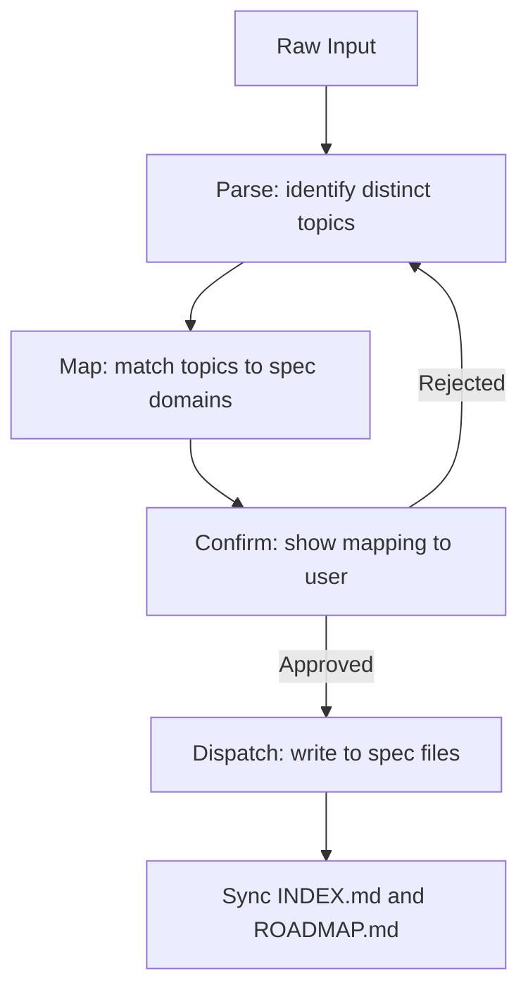

# Specification Workflow

This workflow defines a universal, technology-agnostic process for creating and managing project specifications in the `docs/specifications/` directory. It is designed to be applicable across any stack (Frontend, Backend, Fullstack, GameDev, etc.).

## Agent Guidelines

**CRITICAL INSTRUCTIONS FOR AI:**

1. **No Code in Specs**: Never generate implementation code (Rust, JS, Python, etc.) inside specification files. Use pseudo-code or logic flows if necessary.
2. **Structure First**: Always verify `docs/specifications/INDEX.md` and `ROADMAP.md` exist before creating a new spec.
3. **Universal Applicability**: This workflow is stack-agnostic. Adapt the content (APIs, DBs, UI) to the user's technology, but keep the *structure* rigid.
4. **Automation**: If system files are missing, offer to run the **Initialization Scripts** immediately.
5. **Linking**: Every new spec must be registered in `INDEX.md`. Every spec that depends on another must declare it in `Related Specifications`.
6. **Status Discipline**: Always assign a valid status from the **Status Lifecycle** section. Never leave status blank.
7. **Capture First**: When the user provides unstructured input (thoughts, notes, ideas), always follow the *Dispatching from Raw Input* workflow before writing anything.
8. **Roadmap Is Live**: ROADMAP.md is not a static document. Update it deterministically on every defined trigger — never skip, never defer.

## Directory Structure

The specification documentation follows this structure:

```plaintext
docs/
└── specifications/
    ├── INDEX.md                  # Registry File: Dispatcher & Central Index
    ├── ROADMAP.md                # Planning File: Project Roadmap & Prioritization
    ├── {specification-name}.md   # Content File: Specific logic (e.g., architecture.md)
    └── ...
```

## Status Lifecycle

All specification files must use one of the following statuses:

- **Draft** — work in progress, not ready for review.
- **RFC** *(Request for Comments)* — complete enough for team review, open for feedback and discussion.
- **Stable** — reviewed and approved; implementation can begin.
- **Deprecated** — superseded by another spec; kept for historical reference only.

Status transitions follow this flow:


## Workflow Steps

### Dispatching from Raw Input

Use this workflow when the user provides unstructured input: a thought, a note, a wish, a comment, or any free-form text that contains specification-relevant information.



1. **Parse**: Read the input and extract all distinct topics, decisions, constraints, or preferences mentioned. A single message may contain material for multiple spec files.
2. **Map**: Match each extracted topic to an existing spec file or propose a new one:
    - System design, modules, layers → `architecture.md`
    - Endpoints, contracts, protocols → `api.md`
    - Data models, storage, migrations → `database-schema.md`
    - Visual design, components, style → `ui-components.md`
    - Cross-cutting or unclassified → propose a new domain
3. **Confirm**: Before writing anything, show the user the proposed mapping and wait for explicit approval. Example:

    ```
    I found the following topics in your input:

    - JWT + Redis auth flow       → architecture.md (section 3: Auth Design)
    - REST-only constraint        → architecture.md (section 2: Constraints)
    - shadcn-based design system  → ui-components.md (new file, Draft)

    Proceed with this mapping? (yes / adjust)
    ```

4. **Dispatch**: Write each piece into the correct spec file following the Specification Template. Never mix topics from different domains in a single section.
5. **Sync**: Update `INDEX.md` (add or update rows) and `ROADMAP.md` following the *Updating ROADMAP.md* workflow.

**Edge cases:**

- If intent is ambiguous — ask one clarifying question before mapping, do not guess.
- If a topic doesn't fit any existing domain — propose a new spec file with a suggested name.
- If the input contains contradictions with an existing stable spec — flag the conflict explicitly before dispatching.

---

### Creating a New Specification

1. **Context Analysis**: Determine the domain of the new specification and the project's tech stack.
2. **State Check**: Verify if `docs/specifications/` and its core files exist.
3. **Initialization**:
    - If `INDEX.md` or `ROADMAP.md` are missing, **STOP** and execute the *Core Files Initialization Script* for the user's OS.
4. **Content Creation**:
    - Create `{specification-name}.md` using the *Specification Template*.
    - Use `plaintext` for directory trees and `mermaid` for diagrams.
    - Fill in `Related Specifications` with any dependencies on existing specs.
5. **Registry Update**:
    - Add the new file as a row in the `INDEX.md` table with its status and version.
    - Trigger ROADMAP update: **new spec added** (see *Updating ROADMAP.md*).

### Updating an Existing Specification

1. **Version Bump**: Increment the version according to the change scope:
    - `patch` (0.0.X) — typo fixes, clarifications, no structural change.
    - `minor` (0.X.0) — new section added or existing section extended.
    - `major` (X.0.0) — breaking restructure or significant design change.
2. **Document History**: Append a new row to the `Document History` table inside the spec file.
3. **Status Update**: If the status changes (e.g., `Draft → RFC`), update both the spec file header and the `INDEX.md` table entry.
4. **INDEX.md Sync**: Update the `Version` and `Status` columns in `INDEX.md` to match the new state.
5. **ROADMAP Trigger**: If the status changed or scope shifted, follow the *Updating ROADMAP.md* workflow.

---

### Updating ROADMAP.md

ROADMAP.md is a **live document** that reflects the current state of project priorities and progress. It must be updated deterministically — not based on judgment, but based on defined triggers below.

#### Triggers

Every trigger requires a specific action. No trigger should be ignored.

| Trigger | Required Action |
| :--- | :--- |
| New spec created | Ask user which phase it belongs to; add an entry under that phase |
| Spec status → `Stable` | Move the spec's entry to the active phase; mark it as ready for implementation |
| Spec status → `Deprecated` | Move the spec's entry to the *Archived* section |
| User signals reprioritization | Follow the *Reprioritization* procedure below |
| All specs in a phase reach `Stable` | Follow the *Phase Completion* procedure below |

#### New Spec Added

When a new spec is created, ask the user one question before closing the task:

```
Which phase should "{spec-name}" belong to?

  1. Phase 1 — MVP & Core Features (P0)
  2. Phase 2 — Scalability & Optimization (P1)
  3. New phase — I'll describe it
  4. Backlog — not prioritized yet

```

Then add the spec as a line item under the chosen phase in ROADMAP.md:

```markdown
- **{Spec Name}** (`{spec-name}.md`): {one-line description}. Status: `Draft`
```

#### Status Change → Stable

When any spec transitions to `Stable`, update its line in ROADMAP.md:

```markdown
- **{Spec Name}** (`{spec-name}.md`): {one-line description}. Status: `Stable ✓`
```

This makes ROADMAP a real-time progress indicator: scanning it shows exactly what is done and what is not.

#### Reprioritization

Triggered when the user says something like: *"this is more important now"*, *"let's postpone X"*, *"change the order"*.

1. Show the current phase structure as a summary.
2. Propose the specific moves (item from Phase 2 → Phase 1, etc.).
3. Wait for explicit confirmation before modifying anything.
4. Apply changes and update `Last Updated` in ROADMAP meta.

#### Phase Completion

Triggered when all specs in a phase reach `Stable`.

1. Rename the phase header to include a completion marker:

    ```markdown
    ## Phase 1: MVP & Core Features (P0) ✓ Completed {YYYY-MM-DD}
    ```

2. Propose opening the next phase if not already active.
3. Set `Next Review` in ROADMAP meta to a suggested date (default: +30 days).

#### Backlog

Items not yet assigned to any phase live in a dedicated section:

```markdown
## Backlog (Unprioritized)

- **{Spec Name}** (`{spec-name}.md`): {one-line description}. Status: `Draft`
```

Backlog items should be surfaced during Periodic Registry Audit (every 5 updates) with a prompt to assign them to a phase or discard.

---

## Templates

Use these templates to ensure consistency across all specification files.

### 1. Registry File Template (INDEX.md)

- **Purpose**: Defines the project's specification registry and document hierarchy.
- **Role**: CENTRAL DISPATCHER. Every new specification must be linked here.

```markdown
# Specifications Registry

**Version:** {X.Y.Z}
**Status:** Active

---

## Overview

This index serves as the central registry for all project specifications,
detailing their relationships and current status.

## Core Planning Files

- [ROADMAP.md](ROADMAP.md) - Global project roadmap and prioritization strategy.

## Domain Specifications

| File | Description | Status | Version |
| :--- | :--- | :--- | :--- |
| [api.md](api.md) | API endpoints and authentication flow | Stable | 1.0.0 |
| [database-schema.md](database-schema.md) | SQL structure and migrations | Draft | 0.1.0 |
| [ui-system.md](ui-system.md) | Design system and component library | RFC | 0.3.0 |

---

## Meta Information

- **Maintainer**: Core Team
- **License**: MIT
- **Last Updated**: {YYYY-MM-DD}
```

### 2. Planning File Template (ROADMAP.md)

- **Purpose**: Live planning document. Tracks phases, priorities, and per-spec progress.
- **Role**: Strategic alignment. Every spec must appear here under a phase or in Backlog.

```markdown
# Project Roadmap

**Version:** {X.Y.Z}
**Status:** Active

---

## Overview

Strategic development plan prioritizing core features, resilience, and user experience.

## Phase 1: MVP & Core Features (P0)

- **Feature A** (`architecture.md`): Core system design. Status: `Stable ✓`
- **Feature B** (`api.md`): API contracts and endpoints. Status: `RFC`

## Phase 2: Scalability & Optimization (P1)

- **Performance** (`caching.md`): Caching layer implementation. Status: `Draft`
- **Security** (`auth.md`): OAuth integration. Status: `Draft`

## Backlog (Unprioritized)

- **Analytics** (`analytics.md`): Event tracking design. Status: `Draft`

---

## Meta Information

- **Last Updated**: {YYYY-MM-DD}
- **Next Review**: {YYYY-MM-DD}
```

### 3. Specification File Template ({name}.md)

- **Naming**: Use lowercase, kebab-case. Examples:
  - `architecture.md` (System Design)
  - `api.md` (Interface Contracts)
  - `database-schema.md` (Data Layer)
  - `ui-components.md` (Frontend Design)
- **Purpose**: Detailed specifications for specific logical domains.
- **Rules**:
  - **No Implementation Code**: Do not include actual code (Rust, TS, Python, etc.).
  - **Structure**: Use `plaintext` blocks for directory trees.
  - **Diagrams**: Use `mermaid` blocks for flows and architecture.

```markdown
# {Specification Name}

**Version:** {X.Y.Z}
**Status:** {Draft | RFC | Stable | Deprecated}
**Roadmap Phase:** {Phase 1 | Phase 2 | Backlog}

---

## Overview

Brief summary of the specification's purpose and scope.

## Related Specifications

- [other-spec.md](other-spec.md) - Short description of the dependency or relationship.

## 1. Motivation

Why is this specification needed? What problems does it solve?

## 2. Constraints & Assumptions

- List of hard technical constraints (e.g., "REST only, no GraphQL").
- Key assumptions made during design (e.g., "single-region deployment for MVP").

## 3. Detailed Design

### 3.1 Component A

Technical details, logic, and flows.

**Project Structure:**

```plaintext
src/
└── features/
    └── component_a/
```

**Flow Diagram:**


### 3.2 Component B

...

## 4. Drawbacks & Alternatives

Potential issues and alternative approaches considered.

---

## Document History

| Version | Date       | Author | Description   |
| :---    | :---       | :---   | :---          |
| 0.1.0   | YYYY-MM-DD | User   | Initial Draft |

```

## Core Files Initialization Scripts

Use these scripts to automatically generate the initial `INDEX.md` and `ROADMAP.md` if they are missing.

### MacOS / Linux (Bash)

```bash
#!/bin/bash

# Safety check: warn if not inside a git repository
if [ ! -d ".git" ]; then
  echo "Warning: not a git repository. Are you sure you want to initialize here? (y/n)"
  read -r confirm
  [[ "$confirm" != "y" ]] && echo "Aborted." && exit 1
fi

SPEC_DIR="docs/specifications"
mkdir -p "$SPEC_DIR"

DATE=$(date +%Y-%m-%d)

# Create INDEX.md
if [ ! -f "$SPEC_DIR/INDEX.md" ]; then
cat <<EOF > "$SPEC_DIR/INDEX.md"
# Specifications Registry

**Version:** 1.0.0
**Status:** Active

---

## Overview

This index serves as the central registry for all project specifications,
detailing their relationships and current status.

## Core Planning Files

- [ROADMAP.md](ROADMAP.md) - Global project roadmap and prioritization strategy.

## Domain Specifications

| File | Description | Status | Version |
| :--- | :--- | :--- | :--- |
<!-- Add your specifications here -->

---

## Meta Information

- **Maintainer**: Core Team
- **License**: MIT
- **Last Updated**: $DATE
EOF
echo "Created INDEX.md"
fi

# Create ROADMAP.md
if [ ! -f "$SPEC_DIR/ROADMAP.md" ]; then
cat <<EOF > "$SPEC_DIR/ROADMAP.md"
# Project Roadmap

**Version:** 1.0.0
**Status:** Active

---

## Overview

Strategic development plan prioritizing core features, resilience, and user experience.

## Phase 1: MVP & Core Features (P0)

<!-- Add spec entries here: - **Name** (`file.md`): Description. Status: `Draft` -->

## Backlog (Unprioritized)

<!-- Specs not yet assigned to a phase land here -->

---

## Meta Information

- **Last Updated**: $DATE
- **Next Review**: TBD
EOF
echo "Created ROADMAP.md"
fi
```

### Windows (PowerShell)

```powershell
# Safety check: warn if not inside a git repository
if (!(Test-Path -Path ".git")) {
    $confirm = Read-Host "Warning: not a git repository. Are you sure you want to initialize here? (y/n)"
    if ($confirm -ne "y") { Write-Host "Aborted."; exit 1 }
}

$SpecDir = (Join-Path "docs" "specifications")
if (!(Test-Path -Path $SpecDir)) {
    New-Item -ItemType Directory -Force -Path $SpecDir | Out-Null
}

$Date = Get-Date -Format "yyyy-MM-dd"

# Create INDEX.md
$IndexPath = Join-Path $SpecDir "INDEX.md"
if (!(Test-Path -Path $IndexPath)) {
    $IndexContent = @"
# Specifications Registry

**Version:** 1.0.0
**Status:** Active

---

## Overview

This index serves as the central registry for all project specifications,
detailing their relationships and current status.

## Core Planning Files

- [ROADMAP.md](ROADMAP.md) - Global project roadmap and prioritization strategy.

## Domain Specifications

| File | Description | Status | Version |
| :--- | :--- | :--- | :--- |
<!-- Add your specifications here -->

---

## Meta Information

- **Maintainer**: Core Team
- **License**: MIT
- **Last Updated**: $Date
"@
    Set-Content -Path $IndexPath -Value $IndexContent -Encoding UTF8
    Write-Host "Created INDEX.md"
}

# Create ROADMAP.md
$RoadmapPath = Join-Path $SpecDir "ROADMAP.md"
if (!(Test-Path -Path $RoadmapPath)) {
    $RoadmapContent = @"
# Project Roadmap

**Version:** 1.0.0
**Status:** Active

---

## Overview

Strategic development plan prioritizing core features, resilience, and user experience.

## Phase 1: MVP & Core Features (P0)

<!-- Add spec entries here: - **Name** (``file.md``): Description. Status: ``Draft`` -->

## Backlog (Unprioritized)

<!-- Specs not yet assigned to a phase land here -->

---

## Meta Information

- **Last Updated**: $Date
- **Next Review**: TBD
"@
    Set-Content -Path $RoadmapPath -Value $RoadmapContent -Encoding UTF8
    Write-Host "Created ROADMAP.md"
}
```
