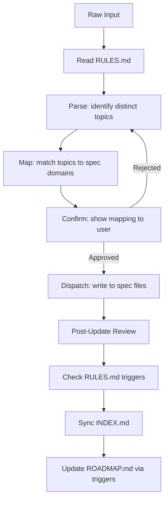

# Specification Workflow

This workflow defines a universal, technology-agnostic process for creating and managing project specifications in the `docs/specifications/` directory. It is designed to be applicable across any stack (Frontend, Backend, Fullstack, GameDev, etc.).

## Agent Guidelines

**CRITICAL INSTRUCTIONS FOR AI:**

1. **No Code in Specs**: Never generate implementation code (Rust, JS, Python, etc.) inside specification files. Use pseudo-code or logic flows if necessary.
2. **Structure First**: Always verify `docs/specifications/INDEX.md`, `ROADMAP.md`, and `RULES.md` exist before creating a new spec.
3. **Universal Applicability**: This workflow is stack-agnostic. Adapt the content (APIs, DBs, UI) to the user's technology, but keep the *structure* rigid.
4. **Automation**: If system files are missing, offer to run the **Initialization Scripts** immediately.
5. **Linking**: Every new spec must be registered in `INDEX.md`. Every spec that depends on another must declare it in `Related Specifications`.
6. **Status Discipline**: Always assign a valid status from the **Status Lifecycle** section. Never leave status blank.
7. **Capture First**: When the user provides unstructured input (thoughts, notes, ideas), always follow the *Dispatching from Raw Input* workflow before writing anything.
8. **Review Always**: After every create or update operation, run *Post-Update Review* before closing the task. No operation is complete without it.
9. **Roadmap Is Live**: ROADMAP.md is not a static document. Update it deterministically on every defined trigger — never skip, never defer.
10. **Rules Are Constitution**: RULES.md is the source of truth for project conventions. Read it before every operation. Update it on every defined trigger. Never contradict it without proposing an explicit amendment.

## Directory Structure

The specification documentation follows this structure:

```plaintext
docs/
└── specifications/
    ├── INDEX.md    # Registry: what exists
    ├── ROADMAP.md  # Plan: what gets done and when
    ├── RULES.md    # Constitution: how everything is governed
    └── *.md        # Spec files
```

**System files and their roles:**

| File | Role | Updated by |
| :--- | :--- | :--- |
| `INDEX.md` | Central registry of all spec files | Every create/update |
| `ROADMAP.md` | Live priority and phase tracker | Defined triggers |
| `RULES.md` | Project constitution and conventions | Defined triggers |

## Status Lifecycle

All specification files must use one of the following statuses:

- **Draft** — work in progress, not ready for review.
- **RFC** *(Request for Comments)* — complete enough for team review, open for feedback and discussion.
- **Stable** — reviewed and approved; implementation can begin.
- **Deprecated** — superseded by another spec; kept for historical reference only.

Status transitions follow this flow:


---

## Workflow Steps

### Dispatching from Raw Input

Use this workflow when the user provides unstructured input: a thought, a note, a wish, a comment, or any free-form text that contains specification-relevant information.



1. **Read RULES.md**: Before doing anything, read `RULES.md` to ensure all decisions align with established project conventions.
2. **Parse**: Read the input and extract all distinct topics, decisions, constraints, or preferences mentioned. A single message may contain material for multiple spec files.
3. **Map**: Match each extracted topic to an existing spec file or propose a new one:
    - System design, modules, layers → `architecture.md`
    - Endpoints, contracts, protocols → `api.md`
    - Data models, storage, migrations → `database-schema.md`
    - Visual design, components, style → `ui-components.md`
    - Cross-cutting or unclassified → propose a new domain
4. **Confirm**: Before writing anything, show the user the proposed mapping and wait for explicit approval. Example:

    ```
    I found the following topics in your input:

    - JWT + Redis auth flow       → architecture.md (section 3: Auth Design)
    - REST-only constraint        → architecture.md (section 2: Constraints)
    - shadcn-based design system  → ui-components.md (new file, Draft)

    Proceed with this mapping? (yes / adjust)
    ```

5. **Dispatch**: Write each piece into the correct spec file following the Specification Template. Never mix topics from different domains in a single section.
6. **Post-Update Review**: Run the review checklist on every file that was modified (see *Post-Update Review*).
7. **Check RULES.md triggers**: After writing, evaluate whether any RULES.md update trigger was activated (see *Updating RULES.md*).
8. **Sync**: Update `INDEX.md` (add or update rows), then update `ROADMAP.md` following the *Updating ROADMAP.md* workflow.

**Edge cases:**

- If intent is ambiguous — ask one clarifying question before mapping, do not guess.
- If a topic doesn't fit any existing domain — propose a new spec file with a suggested name.
- If the input contradicts an existing rule in `RULES.md` — flag the conflict explicitly and ask whether to proceed or amend the rule first.
- If the input contradicts an existing Stable spec — flag the conflict explicitly before dispatching.

---

### Creating a New Specification

1. **Read RULES.md**: Check project conventions before creating anything.
2. **Context Analysis**: Determine the domain of the new specification and the project's tech stack.
3. **State Check**: Verify if `docs/specifications/` and its core files exist.
4. **Initialization**:
    - If `INDEX.md`, `ROADMAP.md`, or `RULES.md` are missing, **STOP** and execute the *Core Files Initialization Script* for the user's OS.
5. **Content Creation**:
    - Create `{specification-name}.md` using the *Specification Template*.
    - Use `plaintext` for directory trees and `mermaid` for diagrams.
    - Fill in `Related Specifications` with any dependencies on existing specs.
6. **Registry Update**:
    - Add the new file as a row in the `INDEX.md` table with its status and version.
    - Trigger ROADMAP update: **new spec added** (see *Updating ROADMAP.md*).
7. **Post-Update Review**: Run the review checklist on the newly created file.
8. **Check RULES.md triggers**: Evaluate whether any RULES.md update trigger was activated.

---

### Updating an Existing Specification

1. **Read RULES.md**: Check project conventions before modifying anything.
2. **Version Bump**: Increment the version according to the change scope:
    - `patch` (0.0.X) — typo fixes, clarifications, no structural change.
    - `minor` (0.X.0) — new section added or existing section extended.
    - `major` (X.0.0) — breaking restructure or significant design change.
3. **Document History**: Append a new row to the `Document History` table inside the spec file.
4. **Status Update**: If the status changes (e.g., `Draft → RFC`), update both the spec file header and the `INDEX.md` table entry.
5. **INDEX.md Sync**: Update the `Version` and `Status` columns in `INDEX.md` to match the new state.
6. **Post-Update Review**: Run the review checklist on every file that was modified. This step is mandatory and must not be skipped.
7. **Check RULES.md triggers**: Evaluate whether any RULES.md update trigger was activated.
8. **ROADMAP Trigger**: If the status changed or scope shifted, follow the *Updating ROADMAP.md* workflow.

---

### Post-Update Review

**Mandatory after every create or update operation, regardless of change size.**

Run the following checks on every file that was modified before closing the task:

#### Duplication Check

- Are there any paragraphs, rules, or decisions that repeat content already stated elsewhere in this file?
- Is any content duplicated across other spec files? If so, keep it in the most relevant file and replace the duplicate with a cross-reference link.

#### Coherence Check

- Does the document read as a single consistent whole, or does it feel like a patchwork of additions?
- Are all sections still relevant to the file's stated purpose, or have any drifted out of scope?
- Is the logical flow of sections still correct after the update, or does the new content break the narrative?

#### Links & Relations Check

- Are all links in `Related Specifications` still accurate and necessary?
- Does the updated content introduce new dependencies on other specs that are not yet declared?

#### Rules Compliance Check

- Does any content in the modified file contradict a rule in `RULES.md`?
- If a contradiction is found — flag it to the user before closing. Do not silently resolve it.

#### Cleanup

- Remove or consolidate any sections that have become redundant.
- Rewrite any passages that have grown unclear due to successive edits.
- If a major restructure is needed, treat it as a `major` version bump and note it in `Document History`.

> If the review reveals significant issues beyond the original edit scope, inform the user and propose a dedicated refactoring pass rather than silently rewriting large portions.

---

### Updating RULES.md

RULES.md is the **project constitution** — the authoritative source of standing decisions and conventions. It is distinct from the workflow (which describes procedures) and from spec files (which describe features). It governs how all spec work is done within this specific project.

**Read RULES.md at the start of every operation. Update it only via defined triggers below.**

#### Triggers

| # | Trigger | Confirmation required |
| :--- | :--- | :--- |
| T1 | User uses universally-scoped language: *"always"*, *"never"*, *"in all specs"*, *"project-wide"* | Yes — propose, then wait |
| T2 | Same pattern appears in 2+ spec files created in the same session | Yes — propose, then wait |
| T3 | Periodic Audit reveals inconsistency that a standing rule would prevent | Yes — propose within audit report |
| T4 | User explicitly declares a rule: *"remember that"*, *"from now on"*, *"project rule:"* | No — apply immediately |

**T1–T3**: Before writing to RULES.md, show the user the proposed rule and wait for explicit approval:

```
I noticed a project-wide convention in your input:

→ Proposed rule: "All APIs must follow REST. GraphQL is not permitted."
→ Section: Project Conventions

Add to RULES.md? (yes / no / adjust)
```

**T4**: Apply immediately, then confirm what was written:

```
Added to RULES.md → Project Conventions:
"All APIs must follow REST. GraphQL is not permitted."
```

#### What Goes in RULES.md

RULES.md has two layers:

**Universal Rules** (sections 1–6) — pre-populated at initialization, govern all projects using this workflow. These are rarely changed and only via explicit user instruction.

**Project Conventions** (section 7) — empty at initialization, accumulates project-specific decisions over time via triggers above. This is the living part of the constitution.

#### Amending an Existing Rule

If new input contradicts a rule already in RULES.md:

1. Flag the contradiction explicitly — never silently override a rule.
2. Ask the user whether to: (a) proceed as-is and amend the rule, (b) follow the existing rule instead, or (c) treat this as a one-time exception without changing the rule.
3. If (a): update the rule, bump RULES.md version (`minor` for amendment, `major` for removal), and add a row to its Document History.

---

### Updating ROADMAP.md

ROADMAP.md is a **live document** that reflects the current state of project priorities and progress. It must be updated deterministically — not based on judgment, but based on defined triggers below.

#### Triggers

Every trigger requires a specific action. No trigger should be ignored.

| Trigger | Required Action |
| :--- | :--- |
| New spec created | Ask user which phase it belongs to; add an entry under that phase |
| Spec status → `Stable` | Update the spec's status marker in place within its phase |
| Spec status → `Deprecated` | Move the spec's entry to the *Archived* section |
| User signals reprioritization | Follow the *Reprioritization* procedure below |
| All specs in a phase reach `Stable` | Follow the *Phase Completion* procedure below |

#### New Spec Added

When a new spec is created, ask the user one question before closing the task:

```
Which phase should "{spec-name}" belong to?

  1. Phase 1 — MVP & Core Features (P0)
  2. Phase 2 — Scalability & Optimization (P1)
  3. New phase — I'll describe it
  4. Backlog — not prioritized yet
```

Then add the spec as a line item under the chosen phase in ROADMAP.md:

```markdown
- **{Spec Name}** (`{spec-name}.md`): {one-line description}. Status: `Draft`
```

#### Status Change → Stable

When any spec transitions to `Stable`, update its line in ROADMAP.md in place — do not move it:

```markdown
- **{Spec Name}** (`{spec-name}.md`): {one-line description}. Status: `Stable ✓`
```

#### Reprioritization

Triggered when the user says something like: *"this is more important now"*, *"let's postpone X"*, *"change the order"*.

1. Show the current phase structure as a summary.
2. Propose the specific moves (item from Phase 2 → Phase 1, etc.).
3. Wait for explicit confirmation before modifying anything.
4. Apply changes and update `Last Updated` in ROADMAP meta.

#### Phase Completion

Triggered when all specs in a phase reach `Stable`.

1. Rename the phase header to include a completion marker:

    ```markdown
    ## Phase 1: MVP & Core Features (P0) ✓ Completed {YYYY-MM-DD}
    ```

2. Propose opening the next phase if not already active.
3. Set `Next Review` in ROADMAP meta to a suggested date (default: +30 days).

#### Backlog

Items not yet assigned to any phase live in a dedicated section:

```markdown
## Backlog (Unprioritized)

- **{Spec Name}** (`{spec-name}.md`): {one-line description}. Status: `Draft`
```

Backlog items are surfaced during *Periodic Registry Audit* with a prompt to assign them to a phase or discard.

---

### Periodic Registry Audit

Run this audit when the user requests it, or proactively suggest it after every 5 updates across the registry.

**Trigger phrase for user**: *"Audit specs"* or *"Review registry"*

1. **Scope**: Read all files listed in `INDEX.md` and `RULES.md`.
2. **Rules Compliance**: Check all spec files against every rule in `RULES.md`. Flag violations.
3. **Cross-file Duplication**: Identify any content that appears in more than one spec file. Propose consolidation.
4. **Orphaned Content**: Flag sections that no longer connect to any feature in `ROADMAP.md`.
5. **Stale Statuses**: Flag specs that have been in `Draft` or `RFC` without progress.
6. **Backlog Review**: Surface all Backlog items and prompt to assign or discard each one.
7. **Broken Relations**: Check that all links in every `Related Specifications` section point to existing files.
8. **Pattern Detection**: If the same approach appears in 2+ specs, propose a Project Convention for RULES.md (T2 trigger).
9. **Report**: Present a structured summary to the user before making any changes:

    ```
    Registry Audit Report — {YYYY-MM-DD}

    Rules violations:
    - api.md uses GraphQL schema — violates RULES.md §7: "REST only"
      → Recommend: update api.md to align with the rule

    Duplication found:
    - "Auth token format" appears in both architecture.md §3.1 and api.md §2.2
      → Recommend: keep in architecture.md, replace api.md entry with a link

    Orphaned content:
    - ui-components.md §4 "Legacy Theme" — not referenced in ROADMAP.md
      → Recommend: deprecate or remove

    Stale statuses:
    - database-schema.md — Draft since 2024-01-10, no updates in 90+ days
      → Recommend: confirm if still active or mark Deprecated

    Backlog items:
    - analytics.md — unprioritized since creation
      → Assign to a phase or discard?

    Broken relations:
    - api.md → links to auth.md which does not exist
      → Recommend: create auth.md or update the link

    Pattern detected (T2 trigger):
    - All specs define a "Single region only" constraint independently
      → Propose adding to RULES.md §7 as a standing Project Convention?

    Apply all recommendations? (yes / select / skip)
    ```

10. **Apply**: Only after user approval, apply the agreed changes. Update `INDEX.md`, `RULES.md`, and `Document History` in affected files.

---

## Templates

### 1. Registry File Template (INDEX.md)

- **Purpose**: Central registry of all spec files and their current state.
- **Role**: DISPATCHER. Every new specification must be linked here.

```markdown
# Specifications Registry

**Version:** {X.Y.Z}
**Status:** Active

---

## Overview

This index serves as the central registry for all project specifications,
detailing their relationships and current status.

## System Files

- [ROADMAP.md](ROADMAP.md) - Live priority and phase tracker.
- [RULES.md](RULES.md) - Project constitution and standing conventions.

## Domain Specifications

| File | Description | Status | Version |
| :--- | :--- | :--- | :--- |
| [api.md](api.md) | API endpoints and authentication flow | Stable | 1.0.0 |
| [database-schema.md](database-schema.md) | SQL structure and migrations | Draft | 0.1.0 |
| [ui-system.md](ui-system.md) | Design system and component library | RFC | 0.3.0 |

---

## Meta Information

- **Maintainer**: Core Team
- **License**: MIT
- **Last Updated**: {YYYY-MM-DD}
```

### 2. Planning File Template (ROADMAP.md)

- **Purpose**: Live planning document. Tracks phases, priorities, and per-spec progress.
- **Role**: Strategic alignment. Every spec must appear here under a phase or in Backlog.

```markdown
# Project Roadmap

**Version:** {X.Y.Z}
**Status:** Active

---

## Overview

Strategic development plan prioritizing core features, resilience, and user experience.

## Phase 1: MVP & Core Features (P0)

- **Feature A** (`architecture.md`): Core system design. Status: `Stable ✓`
- **Feature B** (`api.md`): API contracts and endpoints. Status: `RFC`

## Phase 2: Scalability & Optimization (P1)

- **Performance** (`caching.md`): Caching layer implementation. Status: `Draft`
- **Security** (`auth.md`): OAuth integration. Status: `Draft`

## Backlog (Unprioritized)

- **Analytics** (`analytics.md`): Event tracking design. Status: `Draft`

## Archived

- **Legacy Auth** (`legacy-auth.md`): Deprecated in favour of auth.md. Status: `Deprecated`

---

## Meta Information

- **Last Updated**: {YYYY-MM-DD}
- **Next Review**: {YYYY-MM-DD}
```

### 3. Constitution File Template (RULES.md)

- **Purpose**: Authoritative source of standing conventions for this project.
- **Role**: Governs how all spec work is done. Read before every operation. Updated only via defined triggers.

```markdown
# Project Specification Rules

**Version:** 1.0.0
**Status:** Active

---

## Overview

This file is the constitution of the specification system for this project.
It defines standing rules and conventions that apply to all spec files.
It is read by the agent before every operation and updated only via explicit triggers.

---

## 1. Naming Conventions

- Spec files use lowercase kebab-case: `api.md`, `database-schema.md`, `ui-components.md`.
- System files use uppercase: `INDEX.md`, `ROADMAP.md`, `RULES.md`.
- Section names within specs are title-cased.

## 2. Status Rules

A spec may only change status when the following criteria are met:

- **Draft → RFC**: the spec is complete enough for review; all required sections are filled.
- **RFC → Stable**: the spec has been reviewed and approved; no open questions remain.
- **Any → Deprecated**: the spec has been explicitly superseded; a replacement must be named.

## 3. Versioning Rules

- `patch` (0.0.X): typo fixes, wording clarifications — no structural or content change.
- `minor` (0.X.0): new section added, or existing section meaningfully extended.
- `major` (X.0.0): structural restructure, or a decision that changes the spec's scope.

## 4. Formatting Rules

- Use `plaintext` blocks for all directory trees.
- Use `mermaid` blocks for all flow diagrams and architecture diagrams.
- Do not use other diagram formats.

## 5. Content Rules

- No implementation code in spec files (no Rust, JS, Python, SQL, etc.).
- Pseudo-code and logic flows are permitted where necessary.
- Every spec must have an Overview, Motivation, and Document History section.

## 6. Relations Rules

- Every spec that depends on another must declare it in `Related Specifications`.
- Cross-file content duplication is not permitted — use a link instead.
- Circular dependencies between specs must be flagged and resolved.

## 7. Project Conventions

<!-- This section is populated automatically via RULES.md update triggers.    -->
<!-- Do not edit manually. Propose changes through the agent using T1–T4.     -->

*(No project-specific conventions defined yet.)*

---

## Document History

| Version | Date       | Author | Description              |
| :---    | :---       | :---   | :---                     |
| 1.0.0   | YYYY-MM-DD | Agent  | Initial constitution     |
```

### 4. Specification File Template ({name}.md)

- **Naming**: Use lowercase, kebab-case: `architecture.md`, `api.md`, `database-schema.md`.
- **Rules**: No implementation code. `plaintext` for trees. `mermaid` for diagrams.

```markdown
# {Specification Name}

**Version:** {X.Y.Z}
**Status:** {Draft | RFC | Stable | Deprecated}
**Roadmap Phase:** {Phase 1 | Phase 2 | Backlog}

---

## Overview

Brief summary of the specification's purpose and scope.

## Related Specifications

- [other-spec.md](other-spec.md) - Short description of the dependency or relationship.

## 1. Motivation

Why is this specification needed? What problems does it solve?

## 2. Constraints & Assumptions

- List of hard technical constraints (e.g., "REST only, no GraphQL").
- Key assumptions made during design (e.g., "single-region deployment for MVP").

## 3. Detailed Design

### 3.1 Component A

Technical details, logic, and flows.

**Project Structure:**

```plaintext
src/
└── features/
    └── component_a/
```

**Flow Diagram:**


### 3.2 Component B

...

## 4. Drawbacks & Alternatives

Potential issues and alternative approaches considered.

---

## Document History

| Version | Date       | Author | Description   |
| :---    | :---       | :---   | :---          |
| 0.1.0   | YYYY-MM-DD | User   | Initial Draft |

```

---

## Core Files Initialization Scripts

Use these scripts to automatically generate `INDEX.md`, `ROADMAP.md`, and `RULES.md` if they are missing.

### MacOS / Linux (Bash)

```bash
#!/bin/bash

# Safety check: warn if not inside a git repository
if [ ! -d ".git" ]; then
  echo "Warning: not a git repository. Are you sure you want to initialize here? (y/n)"
  read -r confirm
  [[ "$confirm" != "y" ]] && echo "Aborted." && exit 1
fi

SPEC_DIR="docs/specifications"
mkdir -p "$SPEC_DIR"
DATE=$(date +%Y-%m-%d)

# Create INDEX.md
if [ ! -f "$SPEC_DIR/INDEX.md" ]; then
cat <<EOF > "$SPEC_DIR/INDEX.md"
# Specifications Registry

**Version:** 1.0.0
**Status:** Active

---

## Overview

This index serves as the central registry for all project specifications,
detailing their relationships and current status.

## System Files

- [ROADMAP.md](ROADMAP.md) - Live priority and phase tracker.
- [RULES.md](RULES.md) - Project constitution and standing conventions.

## Domain Specifications

| File | Description | Status | Version |
| :--- | :--- | :--- | :--- |
<!-- Add your specifications here -->

---

## Meta Information

- **Maintainer**: Core Team
- **License**: MIT
- **Last Updated**: $DATE
EOF
echo "Created INDEX.md"
fi

# Create ROADMAP.md
if [ ! -f "$SPEC_DIR/ROADMAP.md" ]; then
cat <<EOF > "$SPEC_DIR/ROADMAP.md"
# Project Roadmap

**Version:** 1.0.0
**Status:** Active

---

## Overview

Strategic development plan prioritizing core features, resilience, and user experience.

## Phase 1: MVP & Core Features (P0)

<!-- Add spec entries here: - **Name** (\`file.md\`): Description. Status: \`Draft\` -->

## Backlog (Unprioritized)

<!-- Specs not yet assigned to a phase land here -->

## Archived

<!-- Deprecated specs move here -->

---

## Meta Information

- **Last Updated**: $DATE
- **Next Review**: TBD
EOF
echo "Created ROADMAP.md"
fi

# Create RULES.md
if [ ! -f "$SPEC_DIR/RULES.md" ]; then
cat <<EOF > "$SPEC_DIR/RULES.md"
# Project Specification Rules

**Version:** 1.0.0
**Status:** Active

---

## Overview

This file is the constitution of the specification system for this project.
It defines standing rules and conventions that apply to all spec files.
It is read by the agent before every operation and updated only via explicit triggers.

---

## 1. Naming Conventions

- Spec files use lowercase kebab-case: \`api.md\`, \`database-schema.md\`, \`ui-components.md\`.
- System files use uppercase: \`INDEX.md\`, \`ROADMAP.md\`, \`RULES.md\`.
- Section names within specs are title-cased.

## 2. Status Rules

A spec may only change status when the following criteria are met:

- **Draft → RFC**: the spec is complete enough for review; all required sections are filled.
- **RFC → Stable**: the spec has been reviewed and approved; no open questions remain.
- **Any → Deprecated**: the spec has been explicitly superseded; a replacement must be named.

## 3. Versioning Rules

- \`patch\` (0.0.X): typo fixes, wording clarifications — no structural or content change.
- \`minor\` (0.X.0): new section added, or existing section meaningfully extended.
- \`major\` (X.0.0): structural restructure, or a decision that changes the spec's scope.

## 4. Formatting Rules

- Use \`plaintext\` blocks for all directory trees.
- Use \`mermaid\` blocks for all flow diagrams and architecture diagrams.
- Do not use other diagram formats.

## 5. Content Rules

- No implementation code in spec files (no Rust, JS, Python, SQL, etc.).
- Pseudo-code and logic flows are permitted where necessary.
- Every spec must have an Overview, Motivation, and Document History section.

## 6. Relations Rules

- Every spec that depends on another must declare it in \`Related Specifications\`.
- Cross-file content duplication is not permitted — use a link instead.
- Circular dependencies between specs must be flagged and resolved.

## 7. Project Conventions

<!-- This section is populated automatically via RULES.md update triggers.    -->
<!-- Do not edit manually. Propose changes through the agent using T1-T4.     -->

*(No project-specific conventions defined yet.)*

---

## Document History

| Version | Date       | Author | Description          |
| :---    | :---       | :---   | :---                 |
| 1.0.0   | $DATE      | Agent  | Initial constitution |
EOF
echo "Created RULES.md"
fi
```

### Windows (PowerShell)

```powershell
# Safety check: warn if not inside a git repository
if (!(Test-Path -Path ".git")) {
    $confirm = Read-Host "Warning: not a git repository. Are you sure you want to initialize here? (y/n)"
    if ($confirm -ne "y") { Write-Host "Aborted."; exit 1 }
}

$SpecDir = (Join-Path "docs" "specifications")
if (!(Test-Path -Path $SpecDir)) {
    New-Item -ItemType Directory -Force -Path $SpecDir | Out-Null
}

$Date = Get-Date -Format "yyyy-MM-dd"

# Create INDEX.md
$IndexPath = Join-Path $SpecDir "INDEX.md"
if (!(Test-Path -Path $IndexPath)) {
    $IndexContent = @"
# Specifications Registry

**Version:** 1.0.0
**Status:** Active

---

## Overview

This index serves as the central registry for all project specifications,
detailing their relationships and current status.

## System Files

- [ROADMAP.md](ROADMAP.md) - Live priority and phase tracker.
- [RULES.md](RULES.md) - Project constitution and standing conventions.

## Domain Specifications

| File | Description | Status | Version |
| :--- | :--- | :--- | :--- |
<!-- Add your specifications here -->

---

## Meta Information

- **Maintainer**: Core Team
- **License**: MIT
- **Last Updated**: $Date
"@
    Set-Content -Path $IndexPath -Value $IndexContent -Encoding UTF8
    Write-Host "Created INDEX.md"
}

# Create ROADMAP.md
$RoadmapPath = Join-Path $SpecDir "ROADMAP.md"
if (!(Test-Path -Path $RoadmapPath)) {
    $RoadmapContent = @"
# Project Roadmap

**Version:** 1.0.0
**Status:** Active

---

## Overview

Strategic development plan prioritizing core features, resilience, and user experience.

## Phase 1: MVP & Core Features (P0)

<!-- Add spec entries here: - **Name** (`file.md`): Description. Status: `Draft` -->

## Backlog (Unprioritized)

<!-- Specs not yet assigned to a phase land here -->

## Archived

<!-- Deprecated specs move here -->

---

## Meta Information

- **Last Updated**: $Date
- **Next Review**: TBD
"@
    Set-Content -Path $RoadmapPath -Value $RoadmapContent -Encoding UTF8
    Write-Host "Created ROADMAP.md"
}

# Create RULES.md
$RulesPath = Join-Path $SpecDir "RULES.md"
if (!(Test-Path -Path $RulesPath)) {
    $RulesContent = @"
# Project Specification Rules

**Version:** 1.0.0
**Status:** Active

---

## Overview

This file is the constitution of the specification system for this project.
It defines standing rules and conventions that apply to all spec files.
It is read by the agent before every operation and updated only via explicit triggers.

---

## 1. Naming Conventions

- Spec files use lowercase kebab-case: `api.md`, `database-schema.md`, `ui-components.md`.
- System files use uppercase: `INDEX.md`, `ROADMAP.md`, `RULES.md`.
- Section names within specs are title-cased.

## 2. Status Rules

A spec may only change status when the following criteria are met:

- **Draft -> RFC**: the spec is complete enough for review; all required sections are filled.
- **RFC -> Stable**: the spec has been reviewed and approved; no open questions remain.
- **Any -> Deprecated**: the spec has been explicitly superseded; a replacement must be named.

## 3. Versioning Rules

- patch (0.0.X): typo fixes, wording clarifications, no structural or content change.
- minor (0.X.0): new section added, or existing section meaningfully extended.
- major (X.0.0): structural restructure, or a decision that changes the spec's scope.

## 4. Formatting Rules

- Use plaintext blocks for all directory trees.
- Use mermaid blocks for all flow diagrams and architecture diagrams.
- Do not use other diagram formats.

## 5. Content Rules

- No implementation code in spec files (no Rust, JS, Python, SQL, etc.).
- Pseudo-code and logic flows are permitted where necessary.
- Every spec must have an Overview, Motivation, and Document History section.

## 6. Relations Rules

- Every spec that depends on another must declare it in Related Specifications.
- Cross-file content duplication is not permitted — use a link instead.
- Circular dependencies between specs must be flagged and resolved.

## 7. Project Conventions

<!-- This section is populated automatically via RULES.md update triggers.  -->
<!-- Do not edit manually. Propose changes through the agent using T1-T4.   -->

*(No project-specific conventions defined yet.)*

---

## Document History

| Version | Date       | Author | Description          |
| :---    | :---       | :---   | :---                 |
| 1.0.0   | $Date      | Agent  | Initial constitution |
"@
    Set-Content -Path $RulesPath -Value $RulesContent -Encoding UTF8
    Write-Host "Created RULES.md"
}
```
