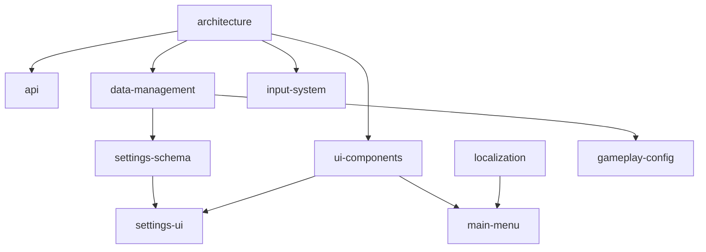

# Implementation Plan

**Version:** 1.0.0
**Generated:** 2026-02-20
**Based on:** .design/INDEX.md v1.2.0
**Status:** Active

## Overview

Implementation plan derived from project specifications, migrated from ROADMAP.md.
Specs are the source of truth. To update: *"Update plan"*.

## Dependency Graph

## Critical Path

`architecture.md` → `data-management.md` → `settings-schema.md` → `settings-ui.md`

## Phase 1 — Foundation

*Specs with no dependencies or core foundation. Start here.*

- **Core Architecture** ([architecture.md](specifications/architecture.md)) — `Draft`
  - Dependencies: none (root)
  - Notes: must be stable before Phase 2

- **Launchpad API** ([api.md](specifications/api.md)) — `Stable ✓`
  - Dependencies: architecture.md

- **Settings Schema** ([settings-schema.md](specifications/settings-schema.md)) — `Stable ✓`
  - Dependencies: data-management.md

- **Data & Assets** ([data-management.md](specifications/data-management.md)) — `Draft`
  - Dependencies: architecture.md

- **Input System** ([input-system.md](specifications/input-system.md)) — `Draft`
  - Dependencies: architecture.md

## Phase 2 — UI/UX & Shared Services

*Core UI foundation and shared services.*

- **UI & Experience** ([ui-components.md](specifications/ui-components.md)) — `Draft`
  - Dependencies: architecture.md

- **Localization** ([localization.md](specifications/localization.md)) — `Draft`
  - Dependencies: architecture.md, data-management.md

- **Main Menu** ([main-menu.md](specifications/main-menu.md)) — `Draft`
  - Dependencies: ui-components.md, localization.md

- **Settings UI** ([settings-ui.md](specifications/settings-ui.md)) — `Draft`
  - Dependencies: settings-schema.md, ui-components.md

## Phase 3 — Polish

*Visual polish and gameplay balancing.*

- **Gameplay Config** ([gameplay-config.md](specifications/gameplay-config.md)) — `Draft`
  - Dependencies: data-management.md

## Unassigned (No Spec File Yet)

- **Transition Orchestrator** — mentioned in ROADMAP.md
- **Theme Engine** — mentioned in ROADMAP.md
- **Accessibility** — mentioned in ROADMAP.md

## Archived
<!-- Deprecated specs moved here -->

## Plan History

| Version | Date | Author | Description |
| :--- | :--- | :--- | :--- |
| 1.0.0 | 2026-02-20 | Agent | Initial plan migrated from ROADMAP.md |
