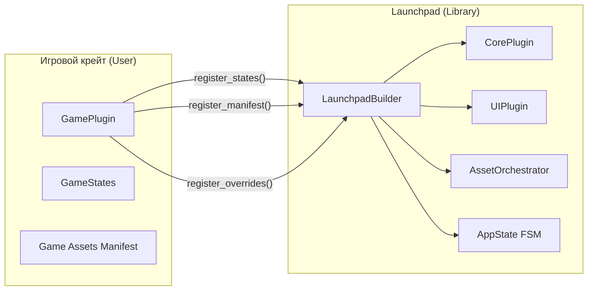
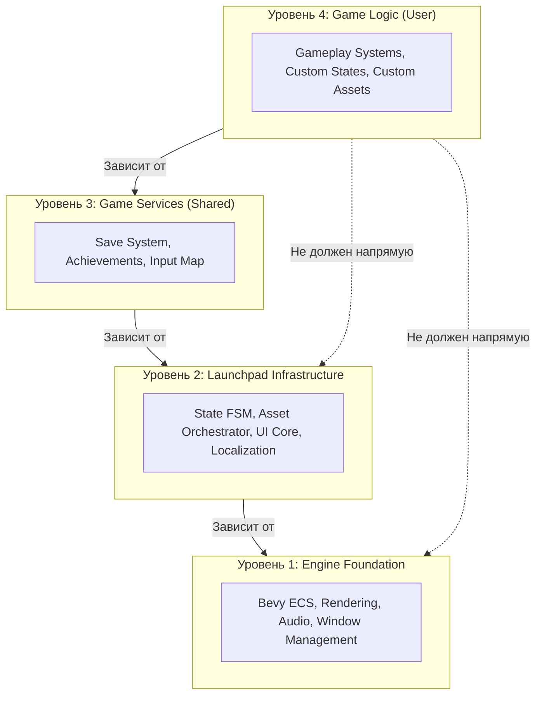
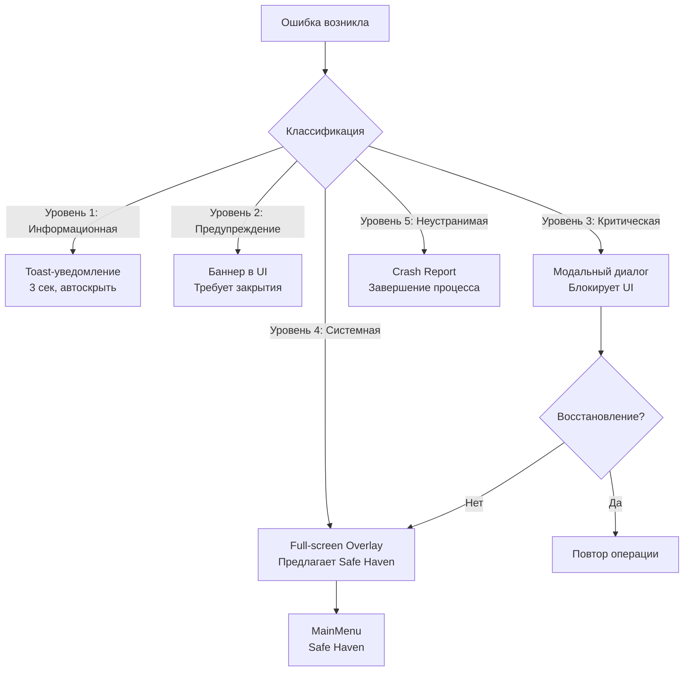
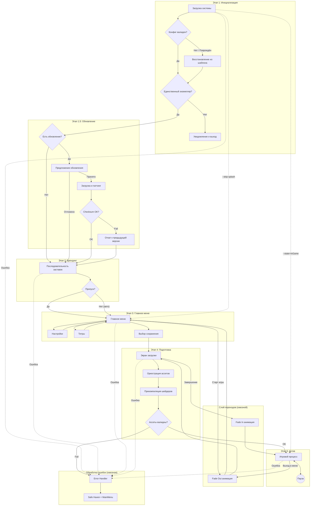
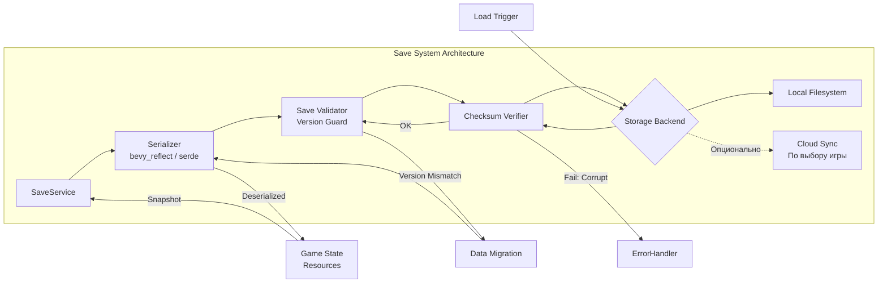
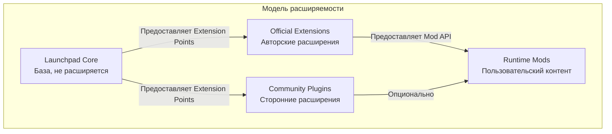
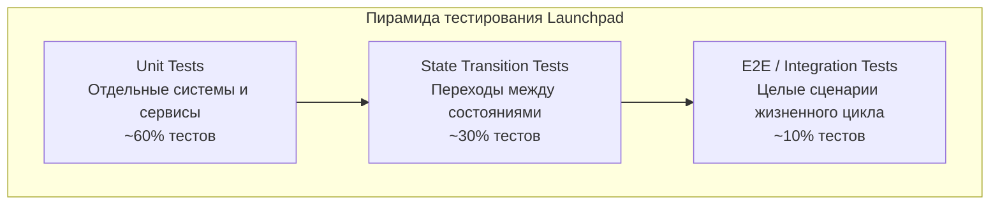
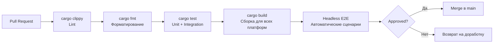

# Анализ и улучшение архитектуры: Bevy Launchpad

---

## Оглавление

1. [Общая оценка архитектуры](#1-общая-оценка-архитектуры)
2. [Критический анализ по разделам](#2-критический-анализ-по-разделам)
3. [Выявленные пробелы](#3-выявленные-пробелы)
4. [Расширенная архитектура](#4-расширенная-архитектура)
5. [Уточнённый жизненный цикл приложения](#5-уточнённый-жизненный-цикл-приложения)
6. [Модуль безопасности и данных](#6-модуль-безопасности-и-данных)
7. [Система плагинов и расширяемость](#7-система-плагинов-и-расширяемость)
8. [Тестирование и CI/CD](#8-тестирование-и-cicd)
9. [Уточнённая структура проекта](#9-уточнённая-структура-проекта)
10. [Дорожная карта и приоритизация](#10-дорожная-карта-и-приоритизация)

---

## 1. Общая оценка архитектуры

### Сильные стороны

Оригинальная спецификация демонстрирует зрелый подход к проектированию игровых фреймворков. Принцип **State-Driven Control** корректно выбран как основа — `AppState` в Bevy является идиоматическим решением, которое обеспечивает детерминированное управление жизненным циклом. Принцип **StateScoped Entities** минимизирует утечки памяти между состояниями, что является одной из наиболее распространённых проблем в игровых проектах на Bevy.

Разделение на слои (Infrastructure vs. Feature) соответствует принципу инверсии зависимостей: библиотека не знает о конкретной игре, игра зависит от библиотеки — но не наоборот.

### Системные риски и слабые места

**Риск 1: Неопределённость контракта между слоями.** Спецификация описывает *что* делает каждый слой, но не определяет *как именно* игра регистрирует свои компоненты в Launchpad. Отсутствует формализованный API контракта — интерфейс между `LaunchpadPlugin` и пользовательским кодом.

**Риск 2: Архитектура переходов.** Раздел 5.3 декларирует "Seamless Flow" с переходами через полное перекрытие экрана, но не описывает, как эти переходы взаимодействуют с асинхронной загрузкой ассетов. Если загрузка завершилась раньше, чем анимация перехода — кто ждёт кого?

**Риск 3: Update-механизм высокого риска.** Раздел 4.3 описывает Auto-Update как последовательность "Check → Download → Patch → Restart", но не определяет ни стратегию отката (rollback), ни верификацию целостности загруженных файлов (checksum/signature). Это критическая уязвимость с точки зрения безопасности.

**Риск 4: Отсутствие стратегии многопоточности.** Декларируется "Fully Asynchronous", но не определена конкретная модель: используются ли `bevy::tasks`, `tokio`, `rayon`? Отсутствие этого решения на уровне архитектуры приведёт к несогласованности реализации.

---

## 2. Критический анализ по разделам

### Раздел 2: System Architecture

**Проблема: Слой Asset Orchestration не покрывает горячую замену.** Таблица "Resource & Config Ownership" описывает статическое разделение владения, но не определяет поведение при `Hot-Reload` (который упомянут в разделе 6.4). Если пользователь переопределяет ресурс библиотеки через Game Override, и файл изменяется на диске — сработает ли реактивное обновление для переопределённого ресурса или только для оригинального?

**Предложение:** Добавить в таблицу владения колонку "Hot-Reload Support" с явным указанием, какие ресурсы поддерживают живое обновление, а какие требуют перезагрузки состояния.

### Раздел 3.2: Asset Orchestration

**Проблема: Манифест как единая точка отказа.** `assets.ron` описывается как единый манифест всех ресурсов. При росте игры этот файл становится узким местом: конфликты при слиянии в системах контроля версий, сложность модульного подключения дополнительных контент-паков.

**Предложение:** Перейти к иерархической системе манифестов — `core.assets.ron` подключает дочерние манифесты (`ui.assets.ron`, `level-01.assets.ron`) через директиву `include`. Это соответствует уже описанной структуре `manifests/` в разделе 9, но явно не задекларировано как архитектурное решение.

### Раздел 4.2: Stage Descriptions

**Проблема: Loading Screen описан слишком поверхностно.** "Прогресс-бар должен отображать числовой процент и название текущей группы" — это UX-требование, но не архитектурное. Не описана система репортинга прогресса: как отдельные системы сообщают о своём прогрессе оркестратору? Какова гранулярность отчётности?

**Предложение:** Ввести формализованный `ProgressReporter` trait/interface, который каждая загружаемая система обязана реализовать. Оркестратор агрегирует данные и вычисляет общий прогресс взвешенным способом (тяжёлые ассеты имеют больший вес).

### Раздел 5.1: Menu Hierarchy

**Проблема: Navigation Stack не описан технически.** Упоминается, что "либа отслеживает историю переходов", но не определена структура данных, глубина стека, поведение при "Back" из корневого меню.

**Предложение:** Формализовать Navigation Stack как часть архитектурного раздела с явным описанием стратегии для граничных случаев (пустой стек → выход из игры с подтверждением).

### Раздел 6.1: Error Recovery

**Проблема: "Safe Haven" не определён.** В разделе 1 упоминается возврат в "безопасное состояние (Safe Haven)", но нигде не определено, что это такое. В разделе 6.1 написано "принудительно возвращает игрока в `MainMenu`" — значит MainMenu и есть Safe Haven? Это должно быть явно задекларировано.

**Проблема: Pink Square как Asset Fallback.** Использование "розового квадрата" — стандартная практика (Source Engine), но не описана стратегия для ненаходимых аудио-ресурсов, шрифтов, шейдеров. У каждого типа ресурса должен быть свой fallback.

---

## 3. Выявленные пробелы

### 3.1 Отсутствующие архитектурные блоки

Следующие системы критически необходимы для AAA-уровня, но полностью отсутствуют в спецификации:

**Система сохранений (Save System).** Упоминается в разделе 5.1 ("Save/Load Logic"), но не имеет собственного архитектурного раздела. Не описаны: формат хранения данных, стратегия сериализации, защита от корруптирования, облачная синхронизация, автосохранение.

**Система достижений (Achievements).** Базовая часть любого современного игрового продукта. Требует архитектурного решения на уровне Launchpad, поскольку триггеры достижений должны быть интегрированы в Event Bus.

**Аналитика и телеметрия.** Упомянуты "Performance Metrics" в чеклисте, но нет архитектурного описания: как данные собираются, агрегируются, отправляются (если отправляются), с согласия пользователя или нет.

**Система DLC и контент-паков.** Если игра предполагает расширяемость, необходим архитектурный блок для динамической загрузки контент-паков, изолированных от основного манифеста.

**Сетевой стек (Multiplayer Foundation).** Даже если текущая версия не предполагает мультиплеер, архитектура должна явно декларировать политику: "мультиплеер не поддерживается" или "заложены хуки для будущей интеграции".

**Система ввода — детализация.** В чеклисте упомянут "Input Remapping", но отсутствует архитектурный раздел. Не описаны: провайдер ввода (leafwing-input-manager?), структура Action Map, сериализация биндингов, конфликты биндингов.

### 3.2 Не описанные сценарии

Спецификация не покрывает следующие runtime-сценарии, которые неизбежно возникнут:

- Поведение при **потере фокуса окна** во время загрузки (пауза загрузки? продолжение в фоне?).
- Поведение при **потере соединения** во время обновления (rollback к предыдущей версии или уведомление?).
- Поведение при **нехватке дискового пространства** во время патчинга.
- Поведение при **повреждении конфигурационного файла** (не отсутствии, а именно повреждении — невалидный RON).
- Поведение при **запуске второго экземпляра** игры: что видит второй процесс?

### 3.3 Доступность (Accessibility)

Полностью отсутствует раздел по Accessibility — требование для современного AAA-продукта:

- Поддержка экранных дикторов (Screen Reader).
- Настраиваемый размер шрифта UI.
- Режим высокого контраста.
- Альтернативные цветовые схемы для людей с нарушением цветовосприятия.
- Поддержка управления только клавиатурой (без мыши).

---

## 4. Расширенная архитектура

### 4.1 Формализованный API Контракт

Ключевым пробелом является отсутствие описания точки входа для пользователя библиотеки. Необходимо ввести концепцию **`LaunchpadBuilder`** — единственного публичного интерфейса, через который игровой код взаимодействует с Launchpad. Это делает зависимость явной и предотвращает "скрытые" интеграции через прямой доступ к ресурсам.

Архитектура взаимодействия слоёв:



### 4.2 Расширенная модель слоёв

Оригинальная модель "2 слоя" недостаточна. Предлагается **4-уровневая модель**:



Уровень 3 (Game Services) — ключевое дополнение. Это сервисы, которые не являются частью инфраструктуры Launchpad, но слишком фундаментальны, чтобы быть частью игровой логики. Launchpad предоставляет *интерфейсы* для этих сервисов, игра — *реализацию* или использует реализации по умолчанию.

### 4.3 Расширенная система обработки ошибок

Оригинальная спецификация описывает только "Global Error Overlay" для критических ошибок. Необходима градуированная система:



---

## 5. Уточнённый жизненный цикл приложения

### 5.1 Расширенная диаграмма переходов

Оригинальная диаграмма из раздела 4.1 корректна, но не отражает механизм синхронизации анимаций переходов с состояниями загрузки. Предлагается расширенная версия с явным слоем переходов:



### 5.2 Архитектура Save System

Система сохранений требует отдельного архитектурного раздела, поскольку затрагивает несколько слоёв:



---

## 6. Модуль безопасности и данных

Данный раздел полностью отсутствует в оригинальной спецификации и является обязательным для продукта, взаимодействующего с файловой системой и сетью.

### 6.1 Безопасность Auto-Update

Процедура автообновления обязана включать следующие механизмы защиты:

**Верификация целостности.** Каждый загружаемый патч должен иметь криптографическую подпись. Перед применением патча система верифицирует подпись публичным ключом, вшитым в бинарный файл. Применение неверифицированного патча запрещено.

**Стратегия отката.** Перед применением патча создаётся резервная копия критических файлов. При неудаче на любом этапе система откатывается к предыдущей версии и информирует пользователя.

**Изолированное применение.** Патчинг должен происходить во временной директории с последующим атомарным переключением, а не поверх работающих файлов.

### 6.2 Защита данных пользователя

**Конфиги и сохранения.** Файлы конфигурации и сохранений хранятся в системных директориях пользователя (`%APPDATA%`, `~/.config`), а не рядом с исполняемым файлом. Это стандартная практика, уже упомянутая в спецификации, но требующая явного указания в контексте безопасности.

**Телеметрия.** Если система аналитики (упомянута в чеклисте как "Performance Metrics") предполагает отправку данных — это требует явного информированного согласия пользователя при первом запуске и возможности отзыва согласия в настройках.

**Изоляция профилей.** При поддержке нескольких профилей пользователей данные каждого профиля должны быть изолированы на уровне файловой системы.

---

## 7. Система плагинов и расширяемость

### 7.1 Модель расширяемости

Оригинальная архитектура описывает разделение "Library vs. Game", но не определяет, как третьи стороны (например, авторы модов или контент-паков) могут расширять функциональность. Предлагается трёхуровневая модель расширяемости:



**Extension Points** — явно задокументированные точки расширения в Launchpad, через которые сторонний код может добавлять:

- Новые экраны в Navigation Stack.
- Новые категории в меню Settings.
- Новые группы ассетов в манифест.
- Новые обработчики событий в Global Event Bus.
- Новые локали.

### 7.2 Версионирование API

Для стабильности экосистемы необходима явная политика версионирования публичного API:

**Semantic Versioning.** Major-версия меняется при breaking changes в публичном API. Minor — при добавлении новых Extension Points. Patch — при исправлениях без изменения API.

**Deprecation Policy.** Публичный API не удаляется немедленно. Устаревшие элементы помечаются как `#[deprecated]` на одну Major-версию, затем удаляются.

---

## 8. Тестирование и CI/CD

Данный раздел полностью отсутствует в оригинальной спецификации. Для библиотеки, претендующей на AAA-качество, стратегия тестирования является архитектурным решением.

### 8.1 Пирамида тестирования



**Unit Tests.** Каждая система Bevy, каждый сервис (SaveService, LocalizationService, AssetOrchestrator) должен быть тестируем в изоляции через `App::new()` с минимальным набором плагинов.

**State Transition Tests.** Автоматизированное тестирование корректности переходов между состояниями: вход → загрузка → выход, очистка StateScoped Entities, корректность порядка выполнения систем.

**E2E Tests.** Запуск полного цикла приложения в headless-режиме (без окна) для проверки критических путей: первый запуск, применение настроек, загрузка сохранения.

### 8.2 Требования к тестируемости архитектуры

Для обеспечения тестируемости архитектура должна соблюдать следующие принципы:

- Все внешние зависимости (файловая система, сеть) взаимодействуют через trait-абстракции, допускающие подмену Mock-реализациями в тестах.
- Ни одна система не обращается к внешним ресурсам напрямую — только через сервисы.
- Временны́е зависимости (анимации, таймеры) параметризуемы и могут быть ускорены или пропущены в тестовом окружении.

### 8.3 Непрерывная интеграция

Минимально необходимый CI-пайплайн для обеспечения качества:



---

## 9. Уточнённая структура проекта

Предлагаемая расширенная структура проекта с учётом выявленных пробелов:

```plaintext
bevy-launchpad/
├── docs/
│   ├── architecture.md             # Основная спецификация
│   ├── architecture-analysis.md    # Данный документ
│   ├── api/                        # Документация публичного API
│   │   ├── extension-points.md     # Extension Points для сторонних разработчиков
│   │   └── migration-guide.md      # Гайд по миграции между версиями
│   └── adr/                        # Architecture Decision Records
│       ├── ADR-001-state-machine.md
│       ├── ADR-002-asset-manifest.md
│       └── ADR-003-update-security.md
│
├── examples/
│   ├── 01-minimal/                 # Минимальная интеграция (Hello World)
│   ├── 02-custom-splash/           # Кастомная заставка
│   ├── 03-settings-override/       # Переопределение настроек
│   ├── 04-full-game/               # Полный пример игры
│   └── 05-mod-integration/         # Пример интеграции мода
│
├── src/
│   ├── lib.rs                      # Публичный API, LaunchpadBuilder
│   ├── boot/                       # Этап 1: Инициализация
│   │   ├── mod.rs
│   │   ├── config.rs               # AppConfig, AppMetadata
│   │   ├── single_instance.rs      # Single Instance Lock
│   │   └── first_launch.rs         # Первый запуск, инициализация окружения
│   ├── update/                     # Этап 1.5: Обновление
│   │   ├── mod.rs
│   │   ├── checker.rs              # Проверка версии
│   │   ├── downloader.rs           # Загрузка патчей
│   │   ├── patcher.rs              # Применение патчей
│   │   ├── verifier.rs             # Checksum + Signature верификация
│   │   └── rollback.rs             # Стратегия отката
│   ├── splash/                     # Этап 2: Брендинг
│   │   ├── mod.rs
│   │   └── sequence.rs             # Управление последовательностью заставок
│   ├── menu/                       # Этап 3: Главное меню
│   │   ├── mod.rs
│   │   ├── navigation.rs           # Navigation Stack
│   │   ├── main_menu.rs
│   │   ├── settings/
│   │   │   ├── mod.rs
│   │   │   ├── audio.rs
│   │   │   ├── video.rs
│   │   │   ├── input.rs            # Input Remapping UI
│   │   │   └── accessibility.rs    # Настройки доступности
│   │   └── credits.rs
│   ├── loading/                    # Этап 4: Загрузка
│   │   ├── mod.rs
│   │   ├── orchestrator.rs         # Asset Orchestrator
│   │   ├── progress.rs             # ProgressReporter
│   │   └── shader_warmup.rs        # Прекомпиляция шейдеров
│   ├── transitions/                # Слой визуальных переходов
│   │   ├── mod.rs
│   │   ├── fade.rs
│   │   ├── vignette.rs
│   │   └── blur.rs
│   ├── error/                      # Система обработки ошибок
│   │   ├── mod.rs
│   │   ├── overlay.rs              # Full-screen Error Overlay
│   │   ├── toast.rs                # Toast-уведомления
│   │   ├── reporter.rs             # Crash Reporting
│   │   └── fallback.rs             # Asset Fallbacks (по типам)
│   ├── save/                       # Save System
│   │   ├── mod.rs
│   │   ├── service.rs              # SaveService
│   │   ├── serializer.rs
│   │   ├── validator.rs
│   │   ├── migration.rs            # Version Guard + Data Migration
│   │   └── storage/
│   │       ├── local.rs            # LocalFS Backend
│   │       └── cloud.rs            # Cloud Sync Backend (trait)
│   ├── input/                      # Input Management
│   │   ├── mod.rs
│   │   ├── action_map.rs           # Action Map Definition
│   │   ├── remapping.rs            # Логика перепривязки клавиш
│   │   └── conflict.rs             # Разрешение конфликтов биндингов
│   ├── localization/               # Система локализации
│   │   ├── mod.rs
│   │   └── fluent.rs               # Fluent Integration
│   ├── theme/                      # Система тем
│   │   └── mod.rs
│   ├── telemetry/                  # Опциональная телеметрия
│   │   ├── mod.rs
│   │   ├── consent.rs              # Управление согласием
│   │   └── reporter.rs             # Отправка метрик
│   └── accessibility/              # Доступность
│       ├── mod.rs
│       ├── screen_reader.rs
│       └── contrast.rs
│
├── assets/
│   ├── locales/
│   │   ├── en-US/
│   │   │   ├── text/
│   │   │   │   ├── menu.ftl
│   │   │   │   ├── settings.ftl
│   │   │   │   ├── errors.ftl      # Сообщения об ошибках
│   │   │   │   └── accessibility.ftl
│   │   │   └── audio/
│   │   └── ru-RU/
│   │       ├── text/
│   │       └── audio/
│   ├── configs/
│   │   └── default.ron             # Базовый AppConfig
│   ├── textures/
│   │   ├── brand/
│   │   └── fallback/               # Fallback-ресурсы по типам
│   │       ├── texture_missing.png # Pink Square
│   │       └── icon_missing.png
│   ├── fonts/
│   │   └── embedded/               # Шрифты, вшиваемые в бинарник
│   │       └── error_ui.ttf
│   ├── shaders/
│   │   └── transitions/            # Шейдеры переходов
│   └── manifests/
│       ├── core.assets.ron         # Корневой манифест
│       ├── ui.assets.ron           # UI-ресурсы
│       └── transitions.assets.ron  # Ресурсы переходов
│
└── tests/
    ├── unit/                       # Unit-тесты систем
    ├── integration/                # State transition тесты
    └── e2e/                        # Headless E2E сценарии
        ├── first_launch.rs
        ├── save_load_cycle.rs
        └── full_lifecycle.rs
```

---

## 10. Дорожная карта и приоритизация

### 10.1 Матрица приоритетов

| Блок | Критичность | Сложность | Приоритет |
| :--- | :---: | :---: | :---: |
| **Формализованный API (LaunchpadBuilder)** | Высокая | Средняя | P0 |
| **Save System** | Высокая | Высокая | P0 |
| **Input System (Action Map + Remapping)** | Высокая | Средняя | P0 |
| **Градуированная система ошибок** | Высокая | Средняя | P1 |
| **Update Security (Checksum + Rollback)** | Высокая | Высокая | P1 |
| **Navigation Stack (формализация)** | Средняя | Низкая | P1 |
| **ProgressReporter** | Средняя | Низкая | P1 |
| **Accessibility** | Средняя | Высокая | P2 |
| **Telemetry (с Consent)** | Низкая | Средняя | P2 |
| **Plugin / Mod System** | Низкая | Высокая | P3 |
| **DLC / Content Packs** | Низкая | Высокая | P3 |

### 10.2 Рекомендованные следующие шаги

**Немедленно (до начала реализации):**

Зафиксировать публичный API через Architecture Decision Records (ADR). Каждое ключевое архитектурное решение (выбор async-рантайма, формат Save System, протокол Update) должно быть задокументировано как ADR с явным описанием рассмотренных альтернатив и обоснованием выбора. Это предотвращает архитектурный дрейф по мере роста команды.

**В рамках первого релиза (v0.1.0):**

Реализовать P0-блоки. Без формализованного API, Save System и Input System продукт не является функционально полным игровым фреймворком. Все остальные блоки, включая AAA-polish (переходы, виньетки, Debug Overlay), имеют смысл только при наличии этой основы.

**До публичного релиза (v1.0.0):**

Закрыть все P1-блоки и провести полный security-аудит системы Auto-Update и Save System. Сформировать публичную документацию Extension Points для сторонних разработчиков.

---

> **Итоговая оценка:** Оригинальная архитектура демонстрирует высокий уровень продуманности в части UX, управления состояниями и визуального полиша. Основные пробелы сосредоточены в трёх областях: безопасность (Update-механизм без верификации), отсутствующие core-системы (Save, Input) и недостаточная спецификация API-контракта между библиотекой и пользовательским кодом. Устранение этих пробелов выведет архитектуру на уровень, соответствующий заявленным AAA-стандартам.
