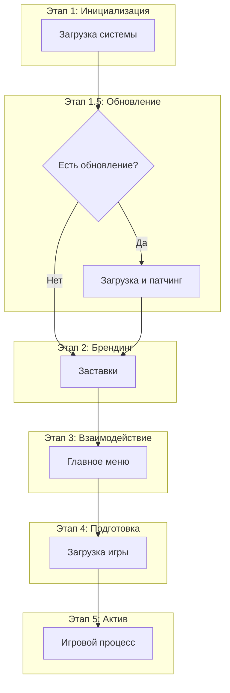

# Core Architecture

**Version:** 0.2.1
**Status:** Draft
**Roadmap Phase:** Phase 1

## Overview

General architectural concept of the Bevy Launchpad framework, guiding principles, and 4-layer model.

## Related Specifications

- [api.md](api.md) - Public interface for users.
- [data-management.md](data-management.md) - Assets and persistence.
- [ui-components.md](ui-components.md) - Interface standards.

## 1. Vision & Core Philosophy

**Bevy Launchpad** — это высокоуровневый фреймворк-шаблон для Bevy, предназначенный для быстрой разработки качественных игр. Основная цель: отделить инфраструктурные задачи (загрузка, меню, настройки) от непосредственной игровой логики.

### Guiding Principles

1. **State-Driven Control**: Каждый этап жизненного цикла приложения является полноценным `AppState`.
2. **Fully Asynchronous**: Все тяжелые операции выносятся в фоновые потоки.
3. **Visual Continuity**: Плавные переходы (затухание, виньетки).
4. **Resilience by Design**: Глобальная обработка ошибок.
5. **User-Centric UX**: Уважение времени игрока (Skip splash).

## 2. System Architecture (The Layered Model)

Архитектура строится на 4-уровневой модели:

- **L1: Engine Foundation**: Bevy ECS, Рендеринг.
- **L2: Launchpad Infrastructure**: Управление состояниями (FSM), Orchestrator, Локализация, UI Core.
- **L3: Game Services (Shared)**: Save System, Input Map, Achievements.
- **L4: Game Logic (User)**: Gameplay Systems, Content.

### Responsibility Split

Launchpad (L2) предоставляет интерфейсы, L3 — сервисы, а L4 — реализацию.

- **Infrastructure Configs (L2)**: `settings.ron` — настройки игрока (APPDATA).
- **Asset Configuration (L2/L4)**: `assets.ron` — внешний манифест ресурсов (Assets).
- **Gameplay Configs (L4)**: `gameplay.ron` — баланс и физика (Assets).

## 3. Detailed Design

### 3.1 ECS & State Management

- **Scene Controller**: Каждое состояние управляет своим контейнером данных.
- **Global Event Bus**: Децентрализованное общение через `SystemEvent`.

### 3.2 Path Reliability

Использование логики `std::env::current_exe()` для гарантированного поиска директории `assets/` при запуске приложения в любом окружении (Direct Run, Terminal, Bundle).

### 3.3 Application Lifecycle

## 4. AAA Quality Standards

|Требование|Описание|
|:---|:---|
|**No Hardcoded Paths**|Пути разрешаются через AssetServer.|
|**Visual Feedback**|Все изменения UI имеют визуальный отклик.|
|**Save Integrity**|Валидация данных до загрузки.|

## Document History

|Version|Date|Author|Description|
|:---|:---|:---|:---|
|0.1.0|2026-02-19|Agent|Initial Draft|
|0.2.0|2026-02-19|Agent|Added Path Reliability (current_exe) details|
|0.2.1|2026-02-19|Agent|Added Roadmap Phase field|
