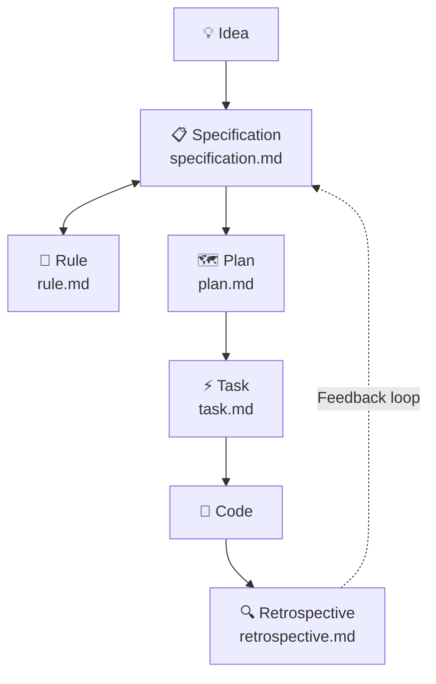

# 🪄 Magic — Specification-Driven Development (SDD) Workflow

Magic is an agentic, Specification-Driven Development (SDD) workflow system. It enforces a rigorous, structured pipeline for AI coding agents, ensuring that **no code is written until a specification is defined, reviewed, and planned.**

It consists of a set of markdown-based workflow instructions for AI agents, effectively acting as an operating system for agentic development.

## 🧭 Core Philosophy

1. **Specs First, Code Later:** The agent is strictly forbidden from writing implementation code from raw user input. All ideas must first be synthesized into a Specification (`.design/specifications/*.md`).
2. **Deterministic Process:** The system enforces a strict pipeline: *Thought → Spec → Plan → Task → Code*.
3. **Constitution-Driven:** All logic is governed by a central rulebook (`.design/RULES.md`), which acts as the project's living constitution.
4. **Self-Improving:** The system collects usage statistics and generates recommendations to improve its own workflows, templates, and checklists.

## 🔗 The Pipeline

Magic operates through **6 core workflows**, forming a complete lifecycle — from raw idea to implemented code, and back to self-analysis:



| # | Workflow | File | Purpose |
|---|---|---|---|
| 1 | **Init** | `init.md` | 🏗️ One-time setup of `.design/` directory, `INDEX.md`, and `RULES.md` |
| 2 | **Specification** | `specification.md` | 📋 Converts raw thoughts into structured specs. Manages statuses (Draft → RFC → Stable → Deprecated) |
| 3 | **Rule** | `rule.md` | 📜 Manages the project constitution (`RULES.md §7`). Add / Amend / Remove / List conventions |
| 4 | **Plan** | `plan.md` | 🗺️ Reads Stable specs, builds dependency graph, extracts critical path, produces phased `PLAN.md` |
| 5 | **Task** | `task.md` | ⚡ Decomposes Plan into atomic tasks with execution tracks. Sequential & Parallel modes |
| 6 | **Retrospective** | `retrospective.md` | 🔍 Analyzes SDD usage, collects metrics, generates improvement recommendations |

## 🏗️ Architecture & Directory Structure

The SDD system consists of three main directories:

1. **`.agent/workflows/magic/`** — AI agent entry points (e.g., slash commands in Cursor or Claude). These thin wrappers (~12 lines each) trigger the actual Magic workflows.
2. **`.magic/`** — The core SDD engine: workflow definitions, templates, scripts, and documentation. Immutable during normal operation.
3. **`.design/`** — The living state of your project. All generated specs, plans, tasks, and retrospectives reside here.

### 📁 Complete Structure Overview

```plaintext
project-root/
│
├── .agent/workflows/magic/     # 🎯 Agent Triggers (entry points)
│   ├── plan.md                 #    → triggers .magic/plan.md
│   ├── retrospective.md        #    → triggers .magic/retrospective.md
│   ├── rule.md                 #    → triggers .magic/rule.md
│   ├── specification.md        #    → triggers .magic/specification.md
│   └── task.md                 #    → triggers .magic/task.md
│
├── .magic/                     # ⚙️ SDD Engine (workflow logic)
│   ├── README.md               #    Documentation (EN)
│   ├── README.ru.md            #    Documentation (RU)
│   ├── init.md                 #    Initialization workflow
│   ├── plan.md                 #    Planning workflow + templates
│   ├── retrospective.md        #    Self-analysis workflow + templates
│   ├── rule.md                 #    Constitution management workflow
│   ├── specification.md        #    Specification authoring workflow + templates
│   ├── task.md                 #    Task decomposition & execution workflow
│   └── scripts/                #    Init scripts
│       ├── init.sh             #       macOS / Linux
│       └── init.ps1            #       Windows
│
└── .design/                    # 📦 Project State & Artifacts (generated)
    ├── INDEX.md                #    Spec registry (names, statuses, versions)
    ├── RULES.md                #    Project constitution
    ├── PLAN.md                 #    Implementation plan with phases
    ├── RETROSPECTIVE.md        #    SDD usage analytics & recommendations
    ├── specifications/         #    Specification files
    │   └── *.md
    └── tasks/                  #    Task execution breakdowns
        ├── TASKS.md            #    Master task index
        └── phase-*.md          #    Per-phase tracks & sequences
```

## ✅ Agent Guidelines & Checklists

To prevent AI hallucination, context drift, or skipped steps, every workflow in Magic enforces **Task Completion Checklists**. An AI agent is not permitted to complete an operation or start writing code without first presenting a confirmed checklist to the user, proving that all bounds, rules, and structures have been respected.

Each checklist item must be marked `✓` (done) or `✗` (skipped/failed). Any `✗` requires an explanation. A task with unresolved `✗` items is **not complete**.

## 🔍 Retrospective — The Feedback Loop

The Retrospective workflow is Magic's **self-improvement mechanism**. It closes the feedback loop by analyzing actual SDD usage data and producing actionable recommendations.

### Why It Exists

Without a feedback loop, the SDD system can accumulate:

- 🧊 **Dead checklists** — items that always pass and waste agent context
- 🔄 **Recurring bottlenecks** — blocking patterns that repeat across phases
- 👻 **Phantom references** — specs in PLAN.md that don't exist in INDEX.md, or vice versa
- 📉 **Workflow friction** — steps that look good on paper but slow down real work

The Retrospective detects these issues **before they compound**.

### What It Tracks

| Category | Key Metrics |
|---|---|
| 📊 **Workflow Efficiency** | Spec status transitions, revisions before Stable, plan stability |
| 🎯 **Dispatch Accuracy** | INDEX ↔ PLAN ↔ TASKS cross-reference mismatches, orphaned specs |
| ⚡ **Task Execution** | Done/Blocked ratio, common blocking reasons, tasks-per-spec granularity |
| 📜 **Constitution Health** | Rule accumulation rate, T1–T3 vs T4 trigger distribution |
| ✅ **Checklist Effectiveness** | Zero-signal items (always ✓), high-failure items (frequently ✗) |

### How It Works

1. **Reads** — Scans `.design/` artifacts (INDEX.md, RULES.md, PLAN.md, TASKS.md, and all spec Document History tables). Lightweight: reads headers and tables, not full spec bodies.
2. **Analyzes** — Cross-references data, identifies patterns, calculates metrics.
3. **Classifies** — Assigns severity to each observation:
    - 🔴 **Critical** — broken references, missing files, contradictions
    - 🟡 **Medium** — inefficiencies, recurring patterns
    - 🟢 **Low** — minor improvements, cosmetic
    - ✨ **Positive** — things working well (positive reinforcement)
4. **Recommends** — For each observation, produces a concrete, actionable recommendation referencing a specific `.magic/` file.
5. **Writes** — Appends a new session entry to `.design/RETROSPECTIVE.md` (never overwrites history).

### When to Run It

The Retrospective is manual by default. Other workflows auto-suggest it:

| Trigger | When |
|---|---|
| 🏁 Phase complete | All tasks in a phase are `Done` |
| 📝 Every 5th spec update | Cumulative updates across the registry |
| 🗺️ Plan major restructure | `PLAN.md` gets a major version bump |

### Example Output

```markdown
📊 Observations

| # | Severity | Area       | Observation                                 |
|---|----------|------------|---------------------------------------------|
| 1 | 🔴       | Tasks      | 3/8 Phase 2 tasks Blocked                   |
| 2 | 🟡       | Specs      | architecture.md: Draft→RFC→Draft→RFC→Stable |
| 3 | 🟢       | Checklists | "No code in specs" never failed in 12 runs  |
| 4 | ✨       | Plan       | Phase 1 completed with 0 Blocked tasks      |

💡 Recommendations

| # | Recommendation                                         | Target File             |
|---|--------------------------------------------------------|-------------------------|
| 1 | Review PLAN.md dependency graph — high blocking rate   | .magic/plan.md          |
| 2 | Add "definition of done" to spec template              | .magic/specification.md |
| 3 | Remove "No code in specs" checklist item — zero signal | .magic/specification.md |
```

## 🚀 Usage

Simply instruct your AI agent (Cursor, Claude, Gemini, or any terminal agent):

| Command | What Happens |
|---|---|
| *"Initialize the project"* | Runs Init → creates `.design/` structure |
| *"Dispatch this thought into specs..."* | Runs Specification → parses, maps, and writes spec files |
| *"Add rule: always use RON format"* | Runs Rule → adds convention to RULES.md §7 |
| *"Create an implementation plan"* | Runs Plan → builds phased plan with dependency graph |
| *"Generate tasks for Phase 1"* | Runs Task → decomposes plan into atomic tasks with tracks |
| *"Execute the next task"* | Runs Task → picks and implements the next available task |
| *"Run retrospective"* | Runs Retrospective → analyzes usage, generates recommendations |

The AI will automatically read the corresponding `.magic/*.md` workflow file and execute the request within the bounds of the SDD system. No code escapes the pipeline. ✨
