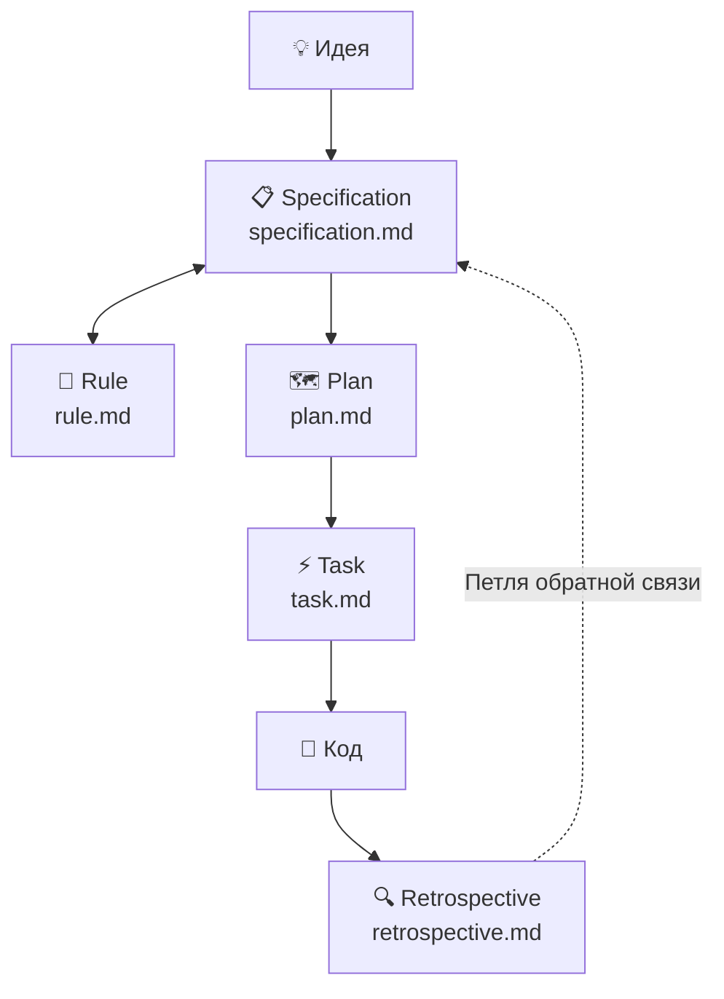

# 🪄 Magic — Система разработки на основе спецификаций (SDD)

Magic — это система и рабочий процесс Specification-Driven Development (SDD), управляемая AI-агентами. Она устанавливает строгий, структурированный конвейер для кодинг-агентов, гарантируя, что **никакой код не будет написан до тех пор, пока спецификация не будет определена, проверена и спланирована.**

Она состоит из набора инструкций в формате Markdown для рабочих процессов AI-агентов, фактически выполняя роль «операционной системы» для агентной разработки.

## 🧭 Ключевая Философия

1. **Сначала Спецификации, Потом Код:** Агенту строго запрещено писать код реализации напрямую из сырых запросов пользователя. Все идеи должны сначала быть преобразованы в структурированную спецификацию (`.design/specifications/*.md`).
2. **Детерминированный Процесс:** Система внедряет строгий конвейер: *Идея → Спецификация → План → Задача → Код*.
3. **Управление через «Конституцию»:** Вся логика подчиняется центральному своду правил (`.design/RULES.md`), который выступает в роли живой конституции проекта.
4. **Самосовершенствование:** Система собирает статистику использования и генерирует рекомендации по улучшению собственных воркфлоу, шаблонов и чек-листов.

## 🔗 Конвейер (Pipeline)

Magic работает через **6 основных воркфлоу**, формирующих полный жизненный цикл — от сырой идеи до написанного кода и обратно к самоанализу:



| # | Воркфлоу | Файл | Назначение |
|---|---|---|---|
| 1 | **Init** | `init.md` | 🏗️ Однократная инициализация директории `.design/`, файлов `INDEX.md` и `RULES.md` |
| 2 | **Specification** | `specification.md` | 📋 Преобразует сырые мысли в структурированные спецификации. Управляет статусами (Draft → RFC → Stable → Deprecated) |
| 3 | **Rule** | `rule.md` | 📜 Управляет конституцией проекта (`RULES.md §7`). Операции: Добавить / Изменить / Удалить / Показать |
| 4 | **Plan** | `plan.md` | 🗺️ Читает Stable-спеки, строит граф зависимостей, извлекает критический путь, создаёт фазовый `PLAN.md` |
| 5 | **Task** | `task.md` | ⚡ Разбивает План на атомарные задачи с треками выполнения. Режимы: Sequential и Parallel |
| 6 | **Retrospective** | `retrospective.md` | 🔍 Анализирует использование SDD, собирает метрики, генерирует рекомендации по улучшению |

## 🏗️ Архитектура и Структура Директорий

Система SDD состоит из трёх основных директорий:

1. **`.agent/workflows/magic/`** — Точки входа для AI-агентов (например, slash-команды в Cursor или Claude). Тонкие обёртки (~12 строк каждая), запускающие основные воркфлоу Magic.
2. **`.magic/`** — Ядро SDD-движка: определения воркфлоу, шаблоны, скрипты и документация. Неизменяемо в процессе обычной работы.
3. **`.design/`** — Живое состояние вашего проекта. Все сгенерированные спецификации, планы, задачи и ретроспективы хранятся здесь.

### 📁 Полный Обзор Структуры

```plaintext
project-root/
│
├── .agent/workflows/magic/     # 🎯 Триггеры Агента (точки входа)
│   ├── plan.md                 #    → запускает .magic/plan.md
│   ├── retrospective.md        #    → запускает .magic/retrospective.md
│   ├── rule.md                 #    → запускает .magic/rule.md
│   ├── specification.md        #    → запускает .magic/specification.md
│   └── task.md                 #    → запускает .magic/task.md
│
├── .magic/                     # ⚙️ Движок SDD (логика воркфлоу)
│   ├── README.md               #    Документация (EN)
│   ├── README.ru.md            #    Документация (RU)
│   ├── init.md                 #    Воркфлоу инициализации
│   ├── plan.md                 #    Воркфлоу планирования + шаблоны
│   ├── retrospective.md        #    Воркфлоу самоанализа + шаблоны
│   ├── rule.md                 #    Воркфлоу управления конституцией
│   ├── specification.md        #    Воркфлоу авторинга спецификаций + шаблоны
│   ├── task.md                 #    Воркфлоу декомпозиции и выполнения задач
│   └── scripts/                #    Скрипты инициализации
│       ├── init.sh             #    macOS / Linux
│       └── init.ps1            #    Windows
│
└── .design/                    # 📦 Состояние Проекта и Артефакты (генерируется)
    ├── INDEX.md                #    Реестр спецификаций (имена, статусы, версии)
    ├── RULES.md                #    Конституция проекта
    ├── PLAN.md                 #    План реализации с разбиением на фазы
    ├── RETROSPECTIVE.md        #    Аналитика использования SDD и рекомендации
    ├── specifications/         #    Файлы спецификаций
    │   └── *.md
    └── tasks/                  #    Разбивка задач
        ├── TASKS.md            #    Главный индекс задач
        └── phase-*.md          #    Отслеживание по фазам (треки и последовательности)
```

## ✅ Руководства для Агентов и Чек-листы

Чтобы предотвратить галлюцинации ИИ, дрейф контекста или пропуск шагов, каждый воркфлоу в Magic требует выполнения **Чек-листа завершения задачи (Task Completion Checklist)**. AI-агенту запрещено завершать операцию или начинать писать код, не предоставив пользователю заполненный и подтверждённый чек-лист. Это доказывает, что все границы, правила и структуры были соблюдены.

Каждый пункт чек-листа помечается `✓` (выполнено) или `✗` (пропущено/провалено). Любой `✗` требует объяснения. Задача с неразрешёнными `✗` **не считается завершённой**.

## 🔍 Ретроспектива — Петля Обратной Связи

Воркфлоу Ретроспективы — это **механизм самосовершенствования** Magic. Он замыкает петлю обратной связи, анализируя реальные данные использования SDD и генерируя практические рекомендации.

### Зачем это нужно

Без петли обратной связи SDD-система может накапливать:

- 🧊 **Мёртвые чек-листы** — пункты, которые всегда проходят и впустую тратят контекст агента
- 🔄 **Повторяющиеся блокировки** — паттерны блокировки, которые кочуют из фазы в фазу
- 👻 **Фантомные ссылки** — спеки в PLAN.md, которых нет в INDEX.md, и наоборот
- 📉 **Трение воркфлоу** — шаги, которые выглядят хорошо на бумаге, но тормозят реальную работу

Ретроспектива обнаруживает эти проблемы **до того, как они накопятся**.

### Что отслеживается

| Категория | Ключевые Метрики |
|---|---|
| 📊 **Эффективность воркфлоу** | Переходы статусов спецификаций, количество ревизий до Stable, стабильность плана |
| 🎯 **Точность маппинга** | Рассогласования INDEX ↔ PLAN ↔ TASKS, «осиротевшие» спецификации |
| ⚡ **Здоровье выполнения задач** | Соотношение Done/Blocked, частые причины блокировки, гранулярность задач |
| 📜 **Здоровье конституции** | Темп накопления правил, распределение триггеров T1–T3 vs T4 |
| ✅ **Эффективность чек-листов** | Пункты с нулевым сигналом (всегда ✓), пункты с высокой ошибочностью (часто ✗) |

### Как это работает

1. **Читает** — Сканирует артефакты в `.design/` (INDEX.md, RULES.md, PLAN.md, TASKS.md и таблицы Document History всех спеков). Лёгкий режим: читает заголовки и таблицы, а не полные тексты спецификаций.
2. **Анализирует** — Перекрёстные ссылки, выявление паттернов, расчёт метрик.
3. **Классифицирует** — Присваивает серьёзность каждому наблюдению:
    - 🔴 **Критично** — битые ссылки, отсутствующие файлы, противоречия
    - 🟡 **Средне** — неэффективности, повторяющиеся паттерны
    - 🟢 **Низко** — мелкие улучшения, косметика
    - ✨ **Позитивно** — то, что работает хорошо (позитивное подкрепление тоже важно)
4. **Рекомендует** — Для каждого наблюдения формирует конкретную, реализуемую рекомендацию с указанием целевого файла в `.magic/`.
5. **Записывает** — Дописывает новую сессию в `.design/RETROSPECTIVE.md` (никогда не перезаписывает историю).

### Когда запускать

Ретроспектива по умолчанию ручная. Другие воркфлоу автоматически предлагают её запустить:

| Триггер | Когда |
|---|---|
| 🏁 Фаза завершена | Все задачи в фазе получили статус `Done` |
| 📝 Каждое 5-е обновление спеков | Накопительно по всему реестру |
| 🗺️ Крупная реструктуризация плана | `PLAN.md` получает мажорную версию |

### Пример Вывода

```markdown
📊 Наблюдения

| # | Серьёзность | Область   | Наблюдение                                              |
|---|-------------|-----------|---------------------------------------------------------|
| 1 | 🔴          | Задачи    | 3 из 8 задач Фазы 2 заблокированы                       |
| 2 | 🟡          | Спеки     | architecture.md: Draft→RFC→Draft→RFC→Stable             |
| 3 | 🟢          | Чек-листы | «No code in specs» ни разу не провалился за 12 запусков |
| 4 | ✨          | План      | Фаза 1 завершена с 0 заблокированных задач              |

💡 Рекомендации

| # | Рекомендация                                                    | Целевой Файл            |
|---|-----------------------------------------------------------------|-------------------------|
| 1 | Пересмотреть граф зависимостей в PLAN.md — высокий % блокировок | .magic/plan.md          |
| 2 | Добавить «definition of done» в шаблон спецификации             | .magic/specification.md |
| 3 | Убрать «No code in specs» из чек-листа — нулевой сигнал         | .magic/specification.md |
```

## 🚀 Использование

Просто дайте команду вашему AI-агенту (Cursor, Claude, Gemini или любой терминальный агент):

| Команда | Что произойдёт |
|---|---|
| *«Инициализируй проект»* | Запускает Init → создаёт структуру `.design/` |
| *«Оформи эту мысль в спецификации...»* | Запускает Specification → парсит, маппит и записывает файлы спеков |
| *«Добавь правило: всегда использовать формат RON»* | Запускает Rule → добавляет конвенцию в RULES.md §7 |
| *«Создай план реализации»* | Запускает Plan → строит фазовый план с графом зависимостей |
| *«Сгенерируй задачи для Фазы 1»* | Запускает Task → разбивает план на атомарные задачи с треками |
| *«Выполни следующую задачу»* | Запускает Task → берёт и выполняет следующую доступную задачу |
| *«Запусти ретроспективу»* | Запускает Retrospective → анализирует использование, генерирует рекомендации |

AI автоматически прочтёт соответствующий файл `.md` из `.magic/` и выполнит запрос в рамках системы SDD. Ни одна строчка кода не ускользнёт от конвейера. ✨
