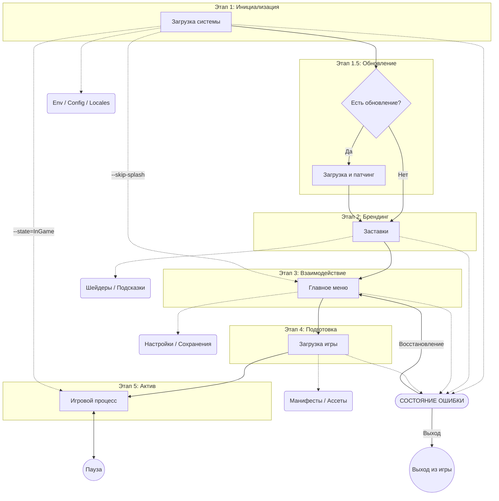
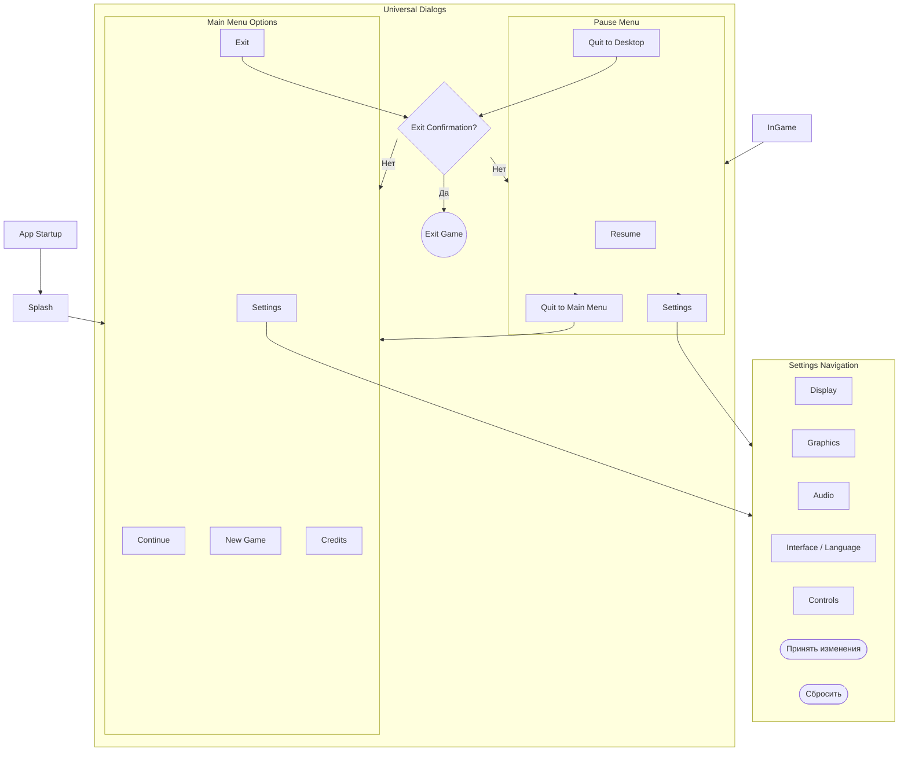

# Architecture: Bevy Launchpad

## Vision & Overview

**Bevy Launchpad** — это высокоуровневый фреймворк-шаблон для Bevy, предназначенный для быстрой разработки качественных игр. Основная цель: отделить инфраструктурные задачи (загрузка, меню, настройки) от непосредственной игровой логики.

## Core Conceptual Split: Launchpad vs. Game Logic

Архитектура строится на четком разделении ответственности между "ядром" (библиотекой) и "игровым наполнением".

### 1. Launchpad (Infrastructure Layer)

Этот слой берет на себя все неигровые процессы:

- **Bootstrapping**: Инициализация Bevy, конфигов и логирования.
- **Splash Screen**: Обработка заставок и параллельная загрузка ресурсов.
- **Service Integration**: Подключение к серверам (если необходимо), проверка обновлений.
- **Core UI**: Главное меню, экран настроек, меню паузы.
- **Management**: Управление темами, локализацией и профилями игроков.

### 2. Game Logic (Feature Layer)

Слой, который реализует сам разработчик:

- **Gameplay States**: Состояния игры (InGame, Paused, LevelSelect).
- **Core Loops**: Системы перемещения, боя и т.д.
- **Custom Assets**: Ресурсы, специфичные для игры.

---

## Guiding Principles (Руководящие принципы)

Эти принципы являются фундаментом разработки Launchpad и обеспечивают AAA-качество финального продукта:

1. **State-Driven Control**: Каждый этап жизненного цикла приложения является полноценным `AppState`. Это обеспечивает строгую типизацию и предсказуемость переходов.
2. **Fully Asynchronous**: Все тяжелые операции (I/O, сетевые запросы, компиляция шейдеров) выносятся в фоновые потоки, чтобы основной игровой цикл всегда оставался отзывчивым (60+ FPS).
3. **Visual Continuity**: Никаких резких скачков. Каждый переход между состояниями сопровождается профессиональными эффектами (затухание, виньетки, размытие).
4. **Resilience by Design**: Глобальная обработка ошибок. Если что-то пошло не так, игрок должен получить понятное сообщение, а система — вернуться в безопасное состояние (например, в главное меню), а не "зависнуть".
5. **User-Centric UX**: Уважение времени игрока. Поддержка пропуска заставок (Skip) и мгновенный доступ к настройкам из любого состояния.

---

## Technical Reference (English)

*Architecture patterns and technical details.*

### ECS Implementation Patterns

Для обеспечения чистоты кода и производительности Launchpad использует следующие ECS-паттерны:

- **State Management & Cleanup**:
  - **StateScoped Entities**: Использование компонентов `StateScoped` (или их эквивалента) для автоматической деспауна сущностей при выходе из состояния. Это гарантирует отсутствие «утечек» UI-элементов или 3D-объектов между уровнями.
  - **OnExit Cleanup**: Явное использование систем `OnExit(State)` для очистки ресурсов, которые не могут быть удалены автоматически (например, остановка фоновой музыки или сброс таймеров).

- **Entity Identification & Filtering**:
  - **Marker Components**: Использование пустых структур-маркеров (напр., `struct SplashScreenMarker;`, `struct MainMenuButton;`) для точной фильтрации сущностей в запросах (`Query`). Это делает системы узкоспециализированными и быстрыми.

- **Reactive UI Architecture**:
  - **Event-driven Updates**: Вместо постоянного опроса ресурсов в каждом кадре (polling), UI обновляется только при возникновении соответствующих событий (напр., `VolumeChangedEvent`, `LanguageSwitchedEvent`).
  - **Change Detection**: Активное использование Bevy `Changed<T>` фильтров в запросах для оптимизации отрисовки и логики.

### Launch Sequence Overview



#### Этапы запуска (Stage Descriptions)

1. **Initialization (Booting)**:
   - *Technical*:
     - **Environment Setup**: Определение путей к ресурсам и конфигам с учетом платформы (`%APPDATA%` для Windows, `~/.local/share` для Linux) для логов и сохранений.
     - **AppMetadata**: Считывание информации о приложении (Название, Версия, Авторы) из `Cargo.toml`.
     - **Diagnostics**: Инициализация `LogPlugin` и систем телеметрии.
     - **Core Init**: Инициализация ядра Bevy (графика, звук, физика).
   - *Launchpad Role*: Подготовка фундамента, проверка **Single Instance Lock** и оповещение о режиме запуска (Dev/Prod).

2. **Branding (Splash)**:
   - *Technical*: Последовательная очередь брендовых видео или изображений. Поддержка гибких фонов (Video/Static/3D). Фоновая прогрессивная загрузка основных текстур интерфейса.
   - *Launchpad Role*: Логика переключения кадров, таймингов и поддержка пропуска (Skip).

3. **Interaction (MainMenu)**:
   - *Technical*: Главный узел управления. Поддержка гибких фонов (Video/Static/3D). Подменю отображаются как дочерние элементы или модальные окна.
   - *Launchpad Role*: Предоставление базовых виджетов и структуры меню, управление фоновой атмосферой.

4. **Preparation (Loading)**:
   - *Technical*: Оркестрация ресурсов на основе «пакетов» (Bundles). Поддержка гибких фонов (Video/Static/3D).
   - *Launchpad Role*: Инфраструктура экрана загрузки (прогресс-бар, игровые подсказки, анимированные индикаторы).

5. **Active (InGame)**:
   - *Technical*: Основной геймплейный цикл. Состояние `Paused` является подсостоянием.
   - *Launchpad Role*: Глобальный перехват `ESC` для вызова `PauseMenu`, управление виртуальным временем (`Time<Virtual>`).

---

### Error Recovery & Stability (Global Oversight)

*Примечание: Данный функционал может быть пересмотрен по мере роста проекта.*

В AAA-индустрии ошибки делятся на критические (краш) и восстановимые. Launchpad фокусируется на **восстановимых ошибках** (например, потеря соединения с сервером или ошибка загрузки уровня):

- **Global Error Overlay**: Универсальное модальное окно, которое может быть вызвано из любой системы только для критических непереносимых ошибок.
- **Fail-safe Logic**:
  - **Asset Missing Strategy**: Использование жестко заданных заглушек (например, ярко-розовая текстура для пропущенных ресурсов) для предотвращения падения движка. Вторичные ассеты могут быть пропущены с записью `WARN` в лог.
  - **Transition Safety**: При сбое переключения состояний система делает запись `ERROR` и принудительно возвращает игрока в `MainMenu` вместо аварийного завершения.
- **Micro-error Minimalist Policy**: Для некритичных ошибок (ошибки аналитики, мелкие сбои UI) запрещено использование блокирующих модальных окон. Ошибки пишутся в консоль/лог, поддерживая плавность игрового процесса.
- **Crash Reporting**: При возникновении фатальной ошибки (Panic), Launchpad перехватывает управление для сбора диагностических данных.

---

### Developer Experience (CLI & Shortcuts)

Для продуктивной разработки мы используем зависимость `clap`. Это позволяет разработчику не тратить время на просмотр заставок по 100 раз в день:

- **State Injection**: Флаг `--state=<STATE>` принудительно устанавливает начальное состояние Bevy.
- **Skip Logic**: Флаг `--skip-splash` отключает этап Branding.
- **Fast-track Assets**: В будущем — возможность передавать путь к конкретной карте/сцене через CLI для мгновенного тестирования.

---

### Instance Management & Config (Singleton Pattern)

Для предотвращения конфликтов доступа к файлам сохранений или базе данных, Launchpad по умолчанию работает в режиме "одного окна".

#### Single Instance Lock

- **Mechanism**: Использование системного Mutex (на Windows) или Lock-файла (на POSIX), привязанного к уникальному идентификатору игры.
- **Verification**: Происходит в самом начале фазы `Booting` до инициализации тяжелых подсистем Bevy (рендер, звук).

#### App Configuration (`AppConfig`)

Библиотека предоставляет структуру конфигурации, которую разработчик может расширять.
Ключевые системные параметры:

| Параметр | Тип | Описание |
| :--- | :--- | :--- |
| `allow_multiple_instances` | `bool` | Разрешить запуск нескольких копий приложения одновременно. |
| `organization_name` | `String` | Используется для создания путей в папке AppData. |
| `application_name` | `String` | Используется для именования Mutex и заголовка окна. |

#### App Metadata (`AppMetadata`)

Статическая информация, считываемая при запуску:

- **Title**: Название игры для заголовка окна.
- **Version**: Версия (из `Cargo.toml`).
- **Authors & Description**: Данные для экрана Credits и метаданных файла.
- **Repository**: Ссылка на исходный код (для Crash Reporter).

---

### UI & Menu Hierarchy (Navigation Tree)

Launchpad предоставляет стандартизированную структуру меню, которую разработчик может наполнять своим контентом.



#### Ключевые принципы UI

- **Navigation Stack**: Либа отслеживает историю переходов, позволяя кнопке "Back" (или ESC) всегда возвращать на предыдущий уровень.
- **Confirmation Flow**: Любое критическое действие (выход из игры, удаление сохранения) должно сопровождаться диалоговым окном подтверждения.
- **Settings Commitment**:
  - **Apply**: Кнопка "Принять изменения" переносит временные настройки в активный стейт и сохраняет их в файл.
  - **Reset**: Кнопка "Сбросить" возвращает настройки к последнему сохраненному состоянию или к значениям по умолчанию.
- **Modular Tabs**: Настройки разбиты на вкладки. Разработчик может добавлять свои вкладки (например, "Mod Settings").
- **Persistence**: Изменения в настройках автоматически сохраняются в файл при закрытии меню или нажатии кнопки "Apply".

#### Modal Dialogs (Confirmations)

Система подтверждений в Launchpad реализована как универсальный сервис:

- **Exit Dialog**: Текст: "Вы уверены, что хотите выйти из игры?". Кнопки: "Да" (закрытие приложения), "Нет" (закрытие диалога).
- **Crash Report Dialog**: Появляется при критическом сбое. Содержит техническую информацию (Stack Trace), поле для ввода описания ошибки пользователем и кнопку "Отправить диагностику".
- **Architecture**: Диалоги являются "оверлеями" (Overlays), которые не меняют основное состояние игры, а накладываются поверх него, блокируя ввод для нижних слоев.

---

### UI Layering & Z-Index Management

Для корректного отображения перекрывающих друг друга элементов, Launchpad использует строгую иерархию слоев (Z-Order). Это гарантирует, что модальные окна всегда будут выше меню, а отладочная информация — выше всех остальных элементов.

| Layer Name | Z-Index (Range) | Description |
| :--- | :--- | :--- |
| **World** | 0 - 99 | Игровой мир, 2D/3D объекты геймплея. |
| **HUD** | 100 - 199 | Игровой интерфейс (здоровье, карта, кроссхейр). |
| **Menus** | 200 - 299 | Главное меню, экран загрузки, заставки. |
| **Settings** | 300 - 399 | Окна настроек, кастомизация. Должны быть выше основного меню. |
| **Modals** | 400 - 499 | Диалоги подтверждения, алерты, системные уведомления. |
| **Error Overlays** | 500 - 999 | Критические ошибки, Crash Reporter. |
| **Debug & Console** | 1000+ | FPS-счетчик, консоль разработчика, инструменты диагностики. |

#### Правила наложения

- **Automatic Assignment**: Launchpad автоматически назначает Z-Index при переключении состояний.
- **Input Blocking**: Слои с более высоким Z-Index автоматически захватывают фокус ввода, если они помечены как `Modal`.

---

### Transitions & Visual Polish

Визуальная непрерывность — один из столпов качественного UX. Launchpad предоставляет встроенную систему переходов (Transitions).

#### Эффекты

- **Fade In/Out**: Стандартное плавное затухание в черный (или заданный цвет).
- **Vignette Wipe**: Переход через сужающуюся виньетку.
- **Blur Transition**: Размытие кадра при переходе в меню паузы.

#### Logic

Система переходов работает как независимый слой над всеми `AppState`. При смене состояния `Old -> New`:

1. Запускается эффект (например, экран темнеет).
2. В момент полного затемнения происходит смена состояния Bevy.
3. Экран плавно светлеет, открывая новое состояние.

---

### Background Rendering & Camera Management

Для создания "живого" интерфейса Launchpad поддерживает различные типы визуального наполнения на заднем плане всех технических экранов (Splash, Menu, Loading).

#### Типы фонов

- **Static Image**: Экономичный вариант (текстура). Используется 2D камера.
- **Video Background**: Проигрывание зацикленного видео (mp4/ogv). Используется 2D камера.
- **3D Scene**: Реальное рендеринг 3D-сцены (например, вращающаяся планета или интерьер комнаты). Требует 3D камеру и соответствующее освещение.

#### Camera Control

- **Automatic Switching**: Launchpad автоматически активирует нужный тип камеры (Orthographic/Perspective) в зависимости от выбранного типа фона для текущего состояния.
- **Persistence**: Фон может сохраняться при переходе между техническими состояниями (например, одна и та же 3D сцена в Главном меню и на Экране загрузки) для достижения идеальной бесшовности.

---

### Logging & Environment Diagnostics

Для прозрачности работы и облегчения отладки Launchpad автоматически определяет и сообщает о режиме запуска.

#### Environment Detection

- **Development (Dev)**: Активируется при компиляции с отладочными символами или через специальные переменные окружения.
  - *Console Output*: `Приложение запущено в режиме разработки`.
  - *Behavior*: Включается расширенное логирование, отладочный UI (FPS, статистика ECS).
- **Production (Prod)**: Активен в финальной сборке.
  - *Console Output*: `Приложение запущено в режиме продакшена`.
  - *Behavior*: Логирование ограничено важными событиями и ошибками для экономии ресурсов.

---

### Update System (Auto-Patcher)

Система автоматического обновления гарантирует, что у игрока всегда актуальная версия приложения.

#### Workflow

1. **Version Check**: Сравнение локальной версии (`Cargo.toml`) с версией в удаленном манифесте.
2. **Download**: Если найдена новая версия, запускается асинхронный процесс загрузки патча/архива.
3. **Applied**: После загрузки приложение заменяет старые файлы (или запускает внешний инсталлятор) и перезапускается.

---

## File structure

```plaintext
bevy-launchpad
├── src/            # Core library logic
├── examples/       # Usage patterns
├── docs/           # Documentation
└── assets/         # Default library assets
```
