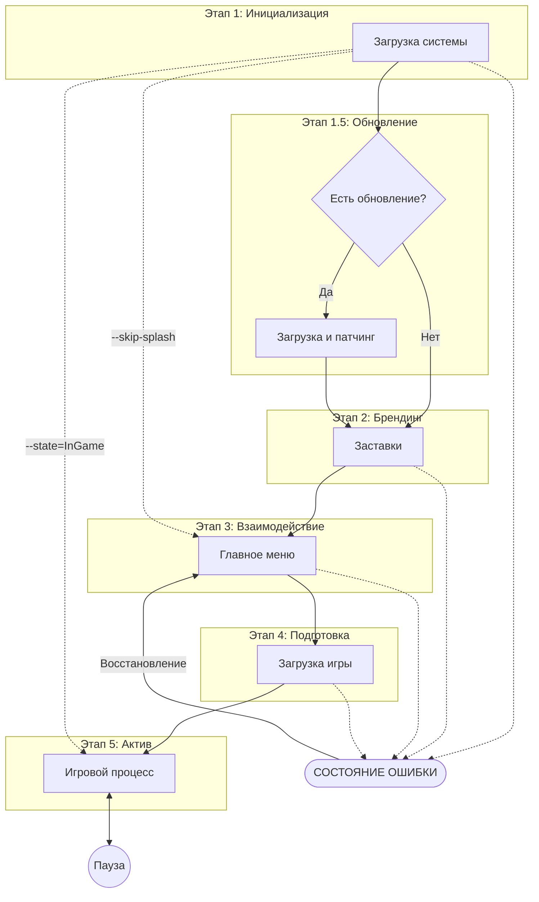

# Architecture: Bevy Launchpad

## 1. Vision & Core Philosophy

**Bevy Launchpad** — это высокоуровневый фреймворк-шаблон для Bevy, предназначенный для быстрой разработки качественных игр. Основная цель: отделить инфраструктурные задачи (загрузка, меню, настройки) от непосредственной игровой логики.

### Guiding Principles (Руководящие принципы)

Эти принципы являются фундаментом разработки Launchpad и обеспечивают AAA-качество финального продукта:

1. **State-Driven Control**: Каждый этап жизненного цикла приложения является полноценным `AppState`. Это обеспечивает строгую типизацию и предсказуемость переходов.
2. **Fully Asynchronous**: Все тяжелые операции (I/O, сетевые запросы, компиляция шейдеров) выносятся в фоновые потоки, чтобы основной игровой цикл всегда оставался отзывчивым (60+ FPS).
3. **Visual Continuity**: Никаких резких скачков. Каждый переход между состояниями сопровождается эффектами (затухание, виньетки, размытие).
4. **Resilience by Design**: Глобальная обработка ошибок. Игрок должен получить понятное сообщение, а система — вернуться в безопасное состояние (Safe Haven), а не "зависнуть".
5. **User-Centric UX**: Уважение времени игрока. Поддержка пропуска заставок (Skip) и мгновенный доступ к настройкам.

### What to Avoid (Чего избегать)

Для поддержания AAA-качества необходимо исключить следующие практики:

- **Длительные «черные экраны»**: Никогда не оставляйте игрока без визуальной обратной связи или индикатора прогресса.
- **Блокирующие операции**: Запрещено выполнение тяжелого I/O или вычислений в основном потоке рендеринга.
- **Принудительные обновления**: Избегайте обязательных патчей без возможности отмены (кроме критических исправлений безопасности).
- **Отсутствие навигации**: Каждое подменю должно иметь четкую кнопку «Назад» или «Отмена» (ESC).

---

## 2. System Architecture (The Layered Model)

Архитектура строится на 4-уровневой модели, обеспечивающей максимальную изоляцию инфраструктуры от логики игры.

### 2.1 Layered Structure

- **L1: Engine Foundation**: Bevy ECS, Рендеринг, Window Management.
- **L2: Launchpad Infrastructure**: Управление состояниями (FSM), Orchestrator, Локализация, UI Core.
- **L3: Game Services (Shared)**: Системы, специфичные для игр, но общие по логике: Save System, Input Map, Achievements, Analytics.
- **L4: Game Logic (User)**: Gameplay Systems, Custom States, ассеты конкретного уровня.

### 2.2 Responsibility Split & API Contract

Launchpad (L2) предоставляет *интерфейсы* и *движок*, L3 предоставляет *сервисы*, а L4 (Игра) — *реализацию* и контент.

| Категория | Launchpad Infrastructure (L2) | Game Services (L3) | Game Logic (L4) |
| :--- | :--- | :--- | :--- |
| **Boot** | Plugin Setup, Path Resolution. | Profile Loading. | Game Setup. |
| **Logic** | AppState FSM. | Input Mapping, Save Management. | Systems, Loops. |
| **UI** | Core Layouts, Themes. | HUD Widgets, Modals. | Level UI. |
| **Assets** | Orchestration Logic. | Asset Manifests. | Custom Models/Textures. |

### 2.3 Resource & Config Ownership

Четкое разделение ресурсов предотвращает конфликты и упрощает обновление библиотеки.

| Категория | Владелец: Launchpad (Lib) | Владелец: Game Logic (User) |
| :--- | :--- | :--- |
| **Configs** | Системные параметры (`AppConfig`), базовые настройки звука/графики. | Игровые параметры, настройки геймплея, бинды клавиш. |
| **Resources** | Шрифты UI, иконки настроек, логотипы Splash, шейдеры переходов. | 3D-модели, игровые текстуры, звуки окружения, музыка. |
| **Localization** | Перевод системных окон (Settings, Exit, Errors, Credits). | Игровые диалоги, названия предметов, описание квестов. |
| **Scenes** | Шаблоны меню, экраны загрузки по умолчанию. | Уровни, игровые локации, кастомные HUD. |

#### Принцип наследования и переопределения (Overriding)

Система спроектирована как многослойная:

1. **Library Defaults (Нижний слой)**: Встроенные ресурсы библиотеки.
2. **Game Overrides (Верхний слой)**: Ресурсы игры. Если в папке игры найден ресурс с таким же ID/путем, он автоматически переопределяет стандартный.

---

## 3. Project Structure

Физическая организация проекта отражает его слоистую архитектуру:

```plaintext
bevy-launchpad/
├── docs/                       # Документация и архитектурные схемы
├── examples/                   # Примеры интеграции (от уровня 1 до уровня 3)
├── src/                        # Исходный код основной библиотеки
└── assets/                     # Стандартные ресурсы Launchpad
    ├── locales/                # Система локализации
    │   ├── en-US/              # Английский (США)
    │   │   ├── text/
    │   │   │   └── menu.ftl    # Файлы Fluent
    │   │   └── audio/          # Региональная озвучка
    │   └── ru-RU/              # Русский (Россия)
    ├── configs/
    │   └── default.ron         # Базовый конфиг (AppConfig)
    ├── textures/
    │   └── brand/              # Логотипы и заставки
    └── manifests/
        └── core.assets.ron     # Манифесты для оркестратора
```

---

## 4. Technical Implementation Patterns

### 4.1 ECS & State Management

Управление сценами и данными в Launchpad полностью интегрировано в систему состояний Bevy.

- **Scene Controller**: Каждое состояние управляет своим контейнером данных (Сценой). При входе — асинхронная загрузка, при выходе — выгрузка.
- **Global Event Bus**: Децентрализованное общение через `SystemEvent`.
- **Save System Architecture**: Слой сериализации (Reflect/Serde) с поддержкой **Version Guard** (миграция данных) и проверкой целостности (Checksum).
- **Input Management**: Анонимная система "Action-based" ввода, работающая через маппинги, а не прямые клавиши.

### 4.2 Asset Orchestration (AAA Approach)

Система управляет тысячами ассетов через манифесты и теги.

- **Manifest (`assets.ron`)**: Все ресурсы регистрируются внешне, что позволяет менять пути без пересборки кода.
- **Bundles & Tags**: Группировка ресурсов (напр., `lib.core`, `level.01`).
- **Orchestrator**: Обрабатывает зависимости и обеспечивает оптимизированную загрузку (включая предварительную компиляцию шейдеров/текстур для GPU).
- **Embedded Resources (In-binary)**: Критически важные ассеты (шрифт для ошибок, базовые иконки) вшиваются в бинарный файл (`include_bytes!`), чтобы система могла работать даже при повреждении папки `assets/`.

### 4.3 Localization System

Использование **Project Fluent** для масштабируемых переводов.

- **Grammar Support**: Нативная поддержка плюрализации (1 день, 5 дней).
- **Key-based Access**: Код ссылается на уникальные ID (напр., `lp.menu.start`).
- **Namespace Splitting**: Использование префиксов `lp.*` для либы и `game.*` для игры.
- **Audio Locales**: Поддержка региональных аудиофайлов внутри структуры локали.
- **Fallback**: Автоматический откат к English (en-US) при отсутствии перевода.

### 4.4 API Contract: LaunchpadBuilder

Ключевая точка входа для пользователя. Все взаимодействия с либой проходят через `LaunchpadBuilder`:

- `register_states()`: Регистрация кастомных состояний игры.
- `add_manifest()`: Подключение игровых ассетов.
- `configure_ux()`: Настройка переходов и визуального стиля.
Это обеспечивает явную зависимость и предсказуемую инициализацию.

---

## 5. Application Lifecycle & Stages

### 5.1 Launch Sequence Overview



### 5.2 Stage Descriptions

1. **Initialization (Booting)**:
   - **First Launch Logic**: Проверка наличия конфигов в системных папках (`%APPDATA%`). Если файлов нет, система автоматически инициализирует окружение из шаблонов `assets/configs/`.
   - **Environment Setup**: Определение путей, считывание `AppMetadata` из `Cargo.toml`, проверка **Single Instance Lock**.
2. **Branding (Splash)**: Последовательность заставок. Пропуск по времени или клику.
3. **Interaction (MainMenu)**: "Safe Haven" стейт. Узел навигации и настроек.
4. **Preparation (Loading)**: Асинхронная оркестрация. **ProgressReporter** агрегирует данные от систем и вычисляет взвешенный прогресс загрузки.
5. **Active (InGame)**: Основной цикл. Включает подсостояние `Paused`.
6. **Transitions (Cross-cutting)**: Слой переходов, который синхронизирует анимацию (Fade) с готовностью ассетов. Если загрузка завершена быстрее анимации — переход ждет завершения визуального эффекта.

### 5.3 Auto-Update Workflow

1. **Check**: Сравнение версий.
2. **Security**: Верификация криптографической подписи патча и контрольных сумм.
3. **Atomic Patch**: Применение обновлений в изолированном каталоге с последующим атомарным переключением.
4. **Rollback Strategy**: Автоматический откат к предыдущей стабильной версии при сбое верификации или патчинга.

---

## 6. User Interface & Experience

### 6.1 Menu Hierarchy & UI Principles

- **Navigation Stack**: Либа отслеживает историю переходов для работы кнопки "Back" и клавиши ESC.
- **Confirmation Flow**: Критические действия (выход, удаление) требуют подтверждения.
- **Settings Commitment**: Изменения применяются явно через "Apply" или сбрасываются через "Reset".
- **Save/Load Logic**: Логика выбора слотов и отображение метаданных (время игры, дата, скриншот) реализуется внутри сервисов меню.

### 6.2 Layering & Z-Order

Строгая иерархия слоев гарантирует корректное перекрытие элементов:

- **World (0-99)**: Игровые объекты.
- **HUD (100-199)**: Интерфейс в игре.
- **Menus (200-299)**: Основные экраны.
- **Settings/Modals (300-499)**: Поверх всех меню.
- **Error/Debug (500+)**: Высший приоритет.

### 6.3 Transitions & Visual Polish

- **Effects**: Fade (затухание), Vignette (виньетка), Blur (размытие при паузе).
- **Seamless Flow**: Смена стейтов Bevy происходит в момент полного перекрытия экрана эффектом (Full Screen Black/White).
- **State Fades**: Плавное появление (fade-in) при входе в стейт и затухание (fade-out) при выходе.

- **Camera Control**: Автоматическое переключение между Orthographic и Perspective камерами в зависимости от типа фона.

### 6.5 UI Framework Tech Stack

Для максимальной совместимости и производительности Launchpad использует стандартный стек `bevy_ui`:

- **Flexbox Positioning**: Верстка макетов через интеграцию с библиотекой Taffy.
- **Interactivity**: Использование стандартных состояний Bevy `Interaction` (Pressed, Hovered, None) для всех элементов ввода.
- **Data-Driven Styling**: Стилизация элементов (цвета, отступы, шрифты) вынесена в ресурсы тем.

### 6.6 Interaction Standards (Juiciness)

Для достижения "AAA feel" интерфейс должен быть отзывчивым и живым:

- **Button Reactivity**: Кнопки имеют анимации при наведении (hover) и нажатии (click) — например, легкое масштабирование или изменение яркости.
- **Visual Feedback**: Все кликабельные элементы должны иметь визуальный отклик.
- **Audio Feedback (SFX)**: Звуковые эффекты при наведении курсора и кликах на элементы интерфейса.

---

## 7. Infrastructure & Reliability

### 7.1 Error Recovery & Stability

- **Global Error Overlay**: Только для критических непереносимых ошибок.
- **Asset Fallback**: При отсутствии ресурса — заглушка (Pink Square) и запись в лог вместо падения.
- **Transition Safety**: При сбое переключения состояний система делает запись `ERROR` и принудительно возвращает игрока в `MainMenu` вместо аварийного завершения.
- **Crash Reporting**: Сбор Stack Trace и диагностика при `Panic`.

### 7.2 Configuration & Metadata

- **AppConfig**: Системные параметры (заголовок окна, организация, запуск нескольких копий).
- **AppMetadata**: Статическая информация (версия, авторы, репозиторий).
- **Version Guard (Migration)**: Все файлы настроек содержат поле `version`. При обновлении библиотеки система выполняет «неразрушающее слияние», сохраняя пользовательские данные.

### 7.3 Logging Standards & Diagnostics

Для прозрачности работы каждый модуль должен предоставлять четкую обратную связь через систему логирования Bevy.

- **[Tagging]**: Каждый лог должен начинаться с тега модуля/плагина (напр., `[BootPlugin]`, `[AssetOrchestration]`) для удобной фильтрации.
- **Log Levels**:
  - `error!`: Критические сбои (конфиг отсутствует, ассеты повреждены, краш системы).
  - `warn!`: Использование стандартных значений (fallbacks) или отсутствие некритичных элементов.
  - `info!`: Смена состояний и важные этапы работы (загрузка завершена, игрок вошел).
  - `debug!`: Детальные шаги логики и данные о производительности для профилирования.
- **Environment Detection**:
  - **Dev**: Включены все уровни логирования, статистика ECS, FPS.
  - **Prod**: Логирование ограничено только важными событиями (`info!`) и ошибками (`error!`).

### 7.4 Live Configuration (Hot-Reloading)

Launchpad поддерживает "живое" обновление параметров без перезапуска:

- **File Watchers**: Постоянное наблюдение за изменениями в `default.ron` и манифестах ассетов.
- **Reactive Updates**: При сохранении файла генерируется `ConfigChangedEvent`, который заставляет системы (аудио, видео, UI) немедленно применить новые значения.

### 7.5 Accessibility (Доступность)

AAA-стандарт требует поддержки альтернативных способов взаимодействия:

- **High Contrast**: Режим повышенной контрастности для UI.
- **Font Scaling**: Динамическое изменение размера шрифта без поломки верстки Taffy.
- **Screen Reader Hooks**: Подготовка компонентов к интеграции с экранными дикторами.
- **Color Blind Modes**: Палитры для людей с особенностями цветовосприятия.

---

## 8. Developer Experience

- **CLI Arguments**: Поддержка флагов `--skip-splash`, `--state=<StateName>` для ускорения разработки.
- **Debug Overlay**: Диагностический слой (State-independent, вызывается по `F1` или `~`), отображающий FPS, память и логи поверх любого экрана.
- **Diagnostic Tools**: Встроенные инструменты мониторинга FPS и памяти в Dev-режиме.

---

## 9. AAA Quality Standards (Checklist)

Эти требования обязательны для реализации в рамках Launchpad для достижения "feel & polish" уровня AAA:

| Требование | Описание |
| :--- | :--- |
| **No Hardcoded Paths** | Все пути к ассетам должны разрешаться через `AssetServer` или специализированные сервисы. |
| **Input Remapping** | Поддержка клавиатуры, мыши и геймпада через "Action-based" систему с возможностью смены биндов. |
| **Visual Feedback** | Все изменения UI (клик, ховер) и переходы стейтов должны иметь визуальный отклик (затухания, виньетки). |
| **High DPI Support** | Корректное масштабирование интерфейса в зависимости от системного коэффициента (Scale Factor). |
| **Save Integrity** | Валидация данных сохранений до перехода в состояние загрузки. |
| **Performance Metrics** | Внутренняя аналитика времени загрузки и выполнения систем для поиска узких мест. |

---

## 10. Roadmap & Prioritization

План развития фреймворка, основанный на критичности и сложности блоков:

### Phase 1: Core Foundation (P0)

- **LaunchpadBuilder**: Реализация публичного API контракта.
- **Input System**: Переход на Action-based маппинги.
- **Save System**: База сериализации и Version Guard.

### Phase 2: Resilience & Security (P1)

- **Update Verification**: Подписи и контрольные суммы.
- **Safe Haven Logic**: Отказоустойчивость стейтов.
- **Graduated Error Handling**: Модалки, тосты и баннеры.

### Phase 3: Visual Polish & UX (P2)

- **Transition Orchestrator**: Синхронизация ассетов и анимаций.
- **Theme Engine**: Гибкая стилизация через RON.
- **Accessibility**: Базовые инструменты доступности.

---
