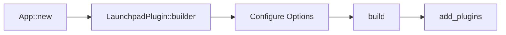

# Public API Contract

**Version:** 0.1.0
**Status:** Draft

---

## Overview

Specification of the public-facing API for Bevy Launchpad, primarily through `LaunchpadBuilder`.

## Related Specifications

- [architecture.md](architecture.md) - System design background.

## 1. Motivation

Provide a predictable, type-safe entry point for game developers to initialize the framework.

## 2. Detailed Design

### 2.1 LaunchpadBuilder

Все взаимодействия с либой проходят через `LaunchpadBuilder`:

- `register_states()`: Регистрация кастомных состояний игры.
- `add_manifest()`: Подключение игровых ассетов.
- `configure_ux()`: Настройка переходов и визуального стиля.

Это обеспечивает явную зависимость и предсказуемую инициализацию.

**Logic Flow:**

---

## Document History

| Version | Date       | Author | Description   |
| :---    | :---       | :---   | :---          |
| 0.1.0   | 2026-02-19 | Agent  | Initial Draft |
