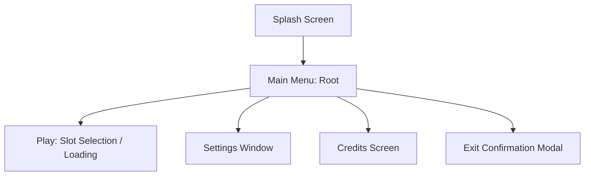

# Main Menu

**Version:** 0.3.0
**Status:** Draft

---

## Overview

Главное меню — это основной интерактивный интерфейс игры. Оно обеспечивает доступ к игровому процессу, настройкам конфигурации и выходу из приложения.

## Related Specifications

- [ui-components.md](ui-components.md) - Visual standards and polish.
- [localization.md](localization.md) - Localization principles.
- [architecture.md](architecture.md) - State management context.

## 1. Functional Requirements

### 1.1 Root Screen

- **Logo/Title**: Центральное отображение визуального стиля игры.
- **Actions Bar**: Список основных команд.
  - **Play**: Запуск игрового цикла (переход в `Loading` -> `InGame`).
  - **Settings**: Открытие окна конфигурации.
  - **Credits**: Экран авторов.
  - **Exit**: Выход из приложения (с подтверждением).

### 1.2 UX Standards

- **Keyboard/Gamepad Navigation**: Полная поддержка выбора элементов без мыши.
- **Back Action**: Клавиша ESC или кнопка "Назад" всегда возвращает на предыдущий уровень в Navigation Stack.

---

## 2. Detailed Design

### 2.1 State Flow

- **Settings Overlay**: Управляется через реактивный ресурс `SettingsOpen`. Это позволяет открывать/закрывать оверлей настроек поверх любого состояния (меню или пауза) без полной смены `AppState`.

### 2.2 Integration Points

- **Events**: Генерация `StartGameEvent` при нажатии Play.
- **Resources**: Использование `MenuTheme` для стилизации элементов.
- **Asset Manifest**: Модуль получает текстуры (`splash_logo`, `background_menu`) и звуки (`click`, `hover`, `music_menu`) через ключи, определенные в `assets.ron`.

---

## Document History

| Version | Date       | Author | Description   |
| :---    | :---       | :---   | :---          |
| 0.1.0   | 2026-02-19 | Agent  | Initial Draft |
| 0.2.0   | 2026-02-19 | Agent  | Added SettingsOpen sub-state detail |
| 0.3.0   | 2026-02-19 | Agent  | Integrated Asset Manifest requirements |
