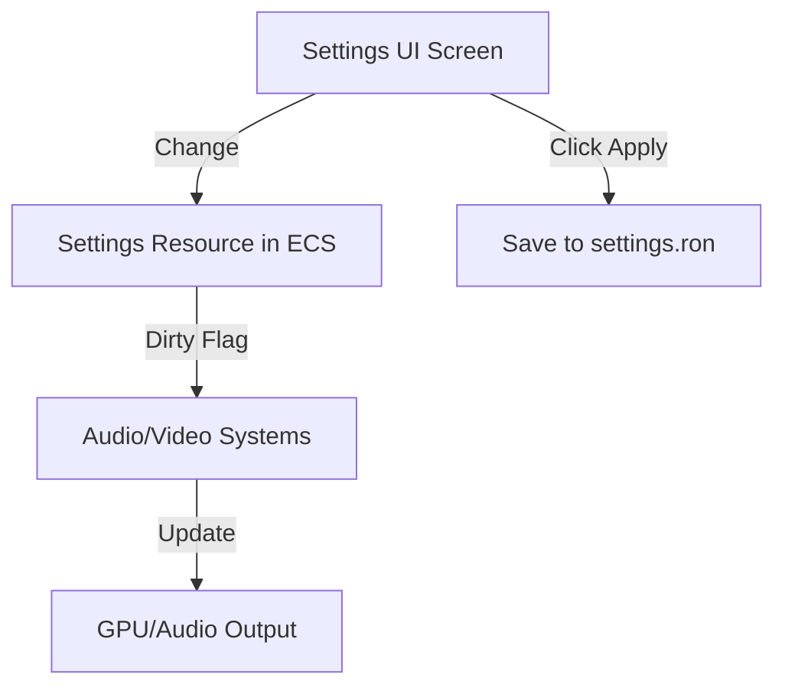

# Settings System (UI/UX)

**Version:** 0.3.1
**Status:** Draft
**Roadmap Phase:** Phase 2

## Overview

Спецификация интерактивного интерфейса настроек. Основная задача: обеспечить "AAA feel" через реактивность и живую обратную связь.

## Related Specifications

- [settings-schema.md](settings-schema.md) - Техническая структура данных (RON).
- [ui-components.md](ui-components.md) - Визуальные стандарты виджетов.

## 1. Functional Requirements

### 1.1 Categories & Navigation

- **Graphics**: Управление визуальным качеством и разрешением.
- **Audio**: Тонкая настройка уровней громкости.
- **Controls**: Переназначение клавиш (Input Remapping).
- **General**: Системные и геймплейные предпочтения.

### 1.2 Interactive Widgets

- **Dynamic Sliders**: Для аудио и масштабирования. Должны воспроизводить характерный "клик" или звук при изменении.
- **Enumerated Selectors**: Для выбора качества (Low -> Ultra) и разрешения.
- **Instant Preview**: Для настроек графики (если возможно) и звука (проигрывание тестового SFX при изменении громкости).

## 2. Detailed Design

### 2.1 State Management Flow

### 2.2 UI Synchronization & Data Flow

- Интерфейс напрямую привязан к ресурсу `UserSettings`.
- Любое изменение в UI генерирует событие `SettingChangedEvent`.
- Фоновая система отслеживает эти события для:
    1. Немедленного обновления состояния движка (окно, звук).
    2. Асинхронной записи изменений в `settings.ron` (при нажатии Apply).

### 2.3 Rebinding Logic

- Ожидание нажатия любой клавиши после клика на действие.
- Проверка конфликтов (одна клавиша на два действия).
- Визуальная индикация активного процесса ожидания ввода.

## Document History

| Version | Date       | Author | Description   |
| :---    | :---       | :---   | :---          |
| 0.1.0   | 2026-02-19 | Agent  | Initial Draft |
| 0.2.0   | 2026-02-19 | Agent  | Added UI/UX flow and widgets details |
| 0.3.0   | 2026-02-19 | Agent  | Integrated SettingChangedEvent and UI Sync logic |
| 0.3.1   | 2026-02-19 | Agent  | Added Roadmap Phase field                        |
